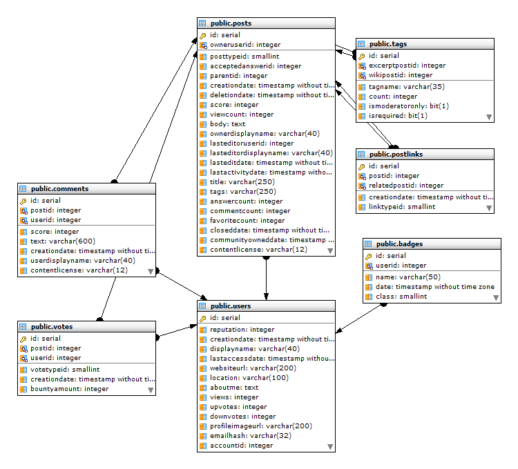

# Original Schema – Subset of Stack Overflow Database

This entry documents a faithful reconstruction of a **subset of the actual Stack Overflow production schema**, used as the foundation for all subsequent portfolio projects.

The schema was extracted and recreated in PostgreSQL with full relational modeling, including foreign key dependencies where applicable. It reflects real-world database complexity, focused on user interactions and core platform behavior.
Note: All of the diagrams you see here are generated using Maestro for PostgreSQL, their link https://www.sqlmaestro.com/products/postgresql/maestro/
---

## 📚 Included Tables

| Table Name | Description                              |
|------------|------------------------------------------|
| users      | Stack Overflow user profiles             |
| posts      | Questions and answers                    |
| comments   | User comments on posts                   |
| votes      | Upvotes/downvotes                        |
| tags       | Tags associated with questions           |
| badges     | System- and community-awarded badges     |
| postlinks  | Relationships between questions/answers  |

---

---

## 🧭 Schema Structure and Central Tables

The structure of this schema revolves around two primary reference points:

### 🧑‍💼 `users` Table – Primary Identity Anchor

- Serves as the **central entity** for all user-generated data.
- Referenced by:
  - `posts.owneruserid`
  - `comments.userid`
  - `votes.userid`
  - `badges.userid`
- All major activity originates from or ties back to `users`.

### 📝 `posts` Table – Core Content Hub

- Stores both **questions and answers** in one table (polymorphic design).
- Connected outward to:
  - `comments.postid`
  - `votes.postid`
  - `postlinks.postid` and `relatedpostid`
  - `posttags` (mapping to `tags`)
- Answers reference their question via `parentid`.

Together, `users` and `posts` form the **spine of the relational graph**. All peripheral tables—such as `comments`, `votes`, `badges`, `tags`, and `postlinks`—extend outward from these anchors.

This design:
- Supports highly normalized storage
- Enables deep analysis of user behavior
- Allows targeted deletions, partitioning, and historical tracking with minimal redundancy

## 📌 Source and References

- **SmartPostgres.com Dump (Used in This Project):**  
  [Stack Overflow Sample Database for PostgreSQL](https://smartpostgres.com/posts/announcing-early-access-to-the-stack-overflow-sample-database-download-for-postgres/)  
  > Note: A few foreign key constraints were missing in the original dump; they were manually reviewed and corrected in this implementation (may have since been updated on SmartPostgres).

- **Also Referenced in SQL Server Training by Brent Ozar:**  
  [Gentle Introduction to the Stack Overflow Schema](https://www.brentozar.com/archive/2018/02/gentle-introduction-stack-overflow-schema/)  
  Brent Ozar uses a SQL Server version of this schema in his industry-recognized database performance training.

- **Original Source (Raw XML Data):**  
  [Stack Exchange Data Dump on Archive.org](https://archive.org/details/stackexchange)

- **Live Schema Explorer:**  
  [Stack Exchange Data Explorer](https://data.stackexchange.com/)

---

## 🧠 Notes

- The `posts` table is polymorphic, storing both questions and answers.
- Foreign key integrity has been preserved or restored where missing.
- This subset focuses on user content and engagement, excluding moderation, messaging, and some metadata tables.

---

## 🖼️ ER Diagram

