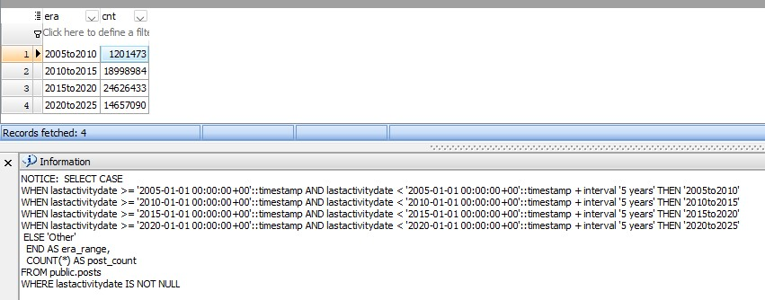

# Portfolio Entry #2 – Partitioned Archival Schema for StackOverflow-style Dataset

## Overview

This project introduces a historical archive system (`hist` schema) designed to optimize long-term data retention, deletion, and analysis for a StackOverflow-style relational database. The system duplicates critical entities such as `posts`, `comments`, `votes`, `tags`, `badges`, and user-related tables from the primary `public` schema, enabling safe, partition-aware archiving.
Note: All of the diagrams you see here are generated using Maestro for PostgreSQL, their link https://www.sqlmaestro.com/products/postgresql/maestro/
## Diagrams & Graphs

Orignal
- 

Alternative
- 


## Key Features

- **Time-based Partitioning**  
  Each table is partitioned by `lastactivitydate` into 5-year ranges (e.g., `2005–2010`, `2010–2015`, etc.) using PostgreSQL native range partitioning. This allows for efficient historical data access and pruning.

- **Structural Cloning with Constraints**  
  Tables in the `hist` schema retain structural fidelity with the original `public` schema, including primary keys, foreign key relationships, and indexes. Constraints are enforced to maintain data integrity across partitions.

- **Trigger-based ID Enforcement**  
  Each partitioned table includes insert triggers that reject duplicate primary key values, ensuring that archived data does not conflict with live or previously inserted records.

- **Bulk Archive Loader**  
  A stored procedure named `create_hist_struct()` builds the entire archive schema and loads data from the `public` schema, respecting partition rules and logging progress by table.

- **Performance Optimizations**  
  Indexes are pre-created during structure generation to avoid costly post-load rebuilds. The design allows selective partition deletion or compression without impacting active data.

## Use Cases

- **Archival & Compliance**  
  Enables long-term historical storage without bloating operational tables.

- **Deletion Engine Synergy**  
  Complements the user deletion engine by offloading stale records safely.

- **Analytical Isolation**  
  Supports historical analysis on a read-optimized structure without affecting transactional performance.

## Why It Matters

This project demonstrates a robust solution for managing data lifecycle in large-scale relational systems. It balances structural integrity, deletion predictability, and performance — all while keeping analytical and operational domains cleanly separated.

## How Did We Get Here?

Partitioning by fixed 5-year eras wasn’t arbitrary — it was based on the real-world distribution of `posts.lastactivitydate`. To support this, a reusable PostgreSQL function named `fn_era_counts()` was created to dynamically group post counts by 5-year intervals:

```sql
CREATE OR REPLACE FUNCTION fn_era_counts()
RETURNS TABLE (era TEXT, cnt BIGINT)
LANGUAGE plpgsql
AS $$
DECLARE
  str TEXT;
  query TEXT := '';
BEGIN
  SET timezone = 'UTC';

  FOR str IN
    SELECT E'SELECT CASE\n'
    UNION ALL
    SELECT format(
      E'  WHEN lastactivitydate >= %L::timestamp AND lastactivitydate < %L::timestamp + interval ''5 years'' THEN ''%s''\n',
      g.dt, g.dt,
      to_char(g.dt, 'YYYY') || '–' || to_char(g.dt + interval '5 years', 'YYYY')
    )
    FROM generate_series('2005-01-01'::date, '2020-01-01'::date, interval '5 years') AS g(dt)
    UNION ALL
    SELECT
      E'  ELSE ''Other''\nEND AS era,\n  COUNT(*) AS cnt\nFROM public.posts\nWHERE lastactivitydate IS NOT NULL\nGROUP BY 1\nORDER BY 1;'
  LOOP
    query := query || str;
  END LOOP;

  RETURN QUERY EXECUTE query;
END;
$$;
```

Here is the output: 
SELECT * FROM fn_era_counts(); 

- 

## Here is how to do it.

``` 
sql
CREATE OR REPLACE PROCEDURE public.create_hist_struct()
AS $BODY$
DECLARE
BEGIN

--DISCARD PLANS;

drop schema if exists hist CASCADE;

create schema hist;

drop table if exists hist.posts_hist;

--Here is where we create the main partitioned table
CREATE TABLE IF NOT EXISTS hist.posts_hist
(
    id bigserial,
    posttypeid smallint NOT NULL,
    acceptedanswerid integer,
    parentid integer,
    creationdate timestamp without time zone NOT NULL,
    deletiondate timestamp without time zone,
    score integer,
    viewcount integer,
    body text COLLATE pg_catalog."default",
    owneruserid integer DEFAULT 0,
    ownerdisplayname character varying(40) COLLATE pg_catalog."default",
    lasteditoruserid integer,
    lasteditordisplayname character varying(40) COLLATE pg_catalog."default",
    lasteditdate timestamp without time zone,
    lastactivitydate timestamp without time zone,
    title character varying(250) COLLATE pg_catalog."default",
    tags character varying(250) COLLATE pg_catalog."default",
    answercount integer,
    commentcount integer,
    favoritecount integer,
    closeddate timestamp without time zone,
    communityowneddate timestamp without time zone,
    contentlicense character varying(12) COLLATE pg_catalog."default"
    
) PARTITION BY RANGE(lastactivitydate);


SET TIME ZONE 'UTC';

--Here is where we create partitions for the table
declare
start_dt timestamp;
end_dt timestamp;
yr text;

begin
for start_dt, end_dt,yr IN
select g.dt, g.dt + interval '5 years',to_char(g.dt,'YYYY')
from generate_series('2005-01-01'::date,'2020-01-01'::date,'5 years') as g(dt)
LOOP

EXECUTE format('CREATE TABLE hist.posts_hist_%sto%s PARTITION OF hist.posts_hist FOR VALUES FROM (%L) TO (%L);',yr,yr::int+5,start_dt,end_dt);

END LOOP;

END;


--Simple insert statement since the stractures are the same;

insert into hist.posts_hist
select * from posts;


---Generating other partitioned tables that have relationships invloving postids, since the posts table is partitioned by "lastactivity" date then the other table must be partitioned by the same called "posts_lastactivitydate", and we are assuming that the table the lastactivitydate in postids could be insert and updated but in other tables it can only be inserted.

DECLARE

stmnt1 text;
stmnt2 text;
BEGIN
FOR stmnt1,stmnt2 IN
SELECT 'DROP TABLE IF EXISTS hist.' || table_name || '_hist;',
  'CREATE TABLE hist.' || table_name || E'_hist (\n' ||
  string_agg(
    '    ' || column_name || ' ' || CASE WHEN column_name ='id' THEN 'BIGSERIAL' ELSE data_type END ||
    CASE 
      WHEN character_maximum_length IS NOT NULL THEN '(' || character_maximum_length || ')'
      ELSE ''
    END ||
    CASE 
      WHEN is_nullable = 'NO' AND column_name <> 'id' THEN ' NOT NULL' 
      ELSE ''
    END
    , E',\n' ORDER BY ordinal_position ASC
  ) || E',\nposts_lastactivitydate timestamp\n) PARTITION BY RANGE(posts_lastactivitydate) ;' 
FROM information_schema.columns
WHERE table_name IN ('comments','votes','tags','postlinks')
  AND table_schema = 'public'
GROUP BY table_schema, table_name
LOOP 
RAISE NOTICE '%',stmnt1;
EXECUTE stmnt1;
RAISE NOTICE '%',stmnt2;
EXECUTE stmnt2;
END LOOP;
END ;

--This is where we create partitions for the tables above

declare
start_dt timestamp;
end_dt timestamp;
yr text;
tbl text;
begin

FOREACH tbl IN ARRAY ARRAY['comments','votes','postlinks','tags']
LOOP

for start_dt, end_dt,yr IN
select g.dt, g.dt + interval '5 years',to_char(g.dt,'YYYY')
from generate_series('2005-01-01'::date,'2020-01-01'::date,'5 years') as g(dt)
LOOP

RAISE NOTICE '%', format('CREATE TABLE hist.%s_hist_%sto%s PARTITION OF hist.%s_hist FOR VALUES FROM (%L) TO (%L);',tbl,yr,yr::int+5,tbl,start_dt,end_dt);
EXECUTE format('CREATE TABLE hist.%s_hist_%sto%s PARTITION OF hist.%s_hist FOR VALUES FROM (%L) TO (%L);',tbl,yr,yr::int+5,tbl,start_dt,end_dt);

END LOOP;

END LOOP;

END;


--fill in the data

declare
start_dt timestamp;
end_dt timestamp;
yr text;
tbl text;
begin

FOREACH tbl IN ARRAY ARRAY['comments','votes','postlinks']
LOOP

RAISE NOTICE '%',format(E'INSERT INTO hist.%s_hist \nSELECT %s.*,posts.lastactivitydate FROM public.%s INNER JOIN public.posts ON posts.id = %s.postid;',tbl,tbl,tbl,tbl);
EXECUTE format(E'INSERT INTO hist.%s_hist \nSELECT %s.*,posts.lastactivitydate FROM public.%s INNER JOIN public.posts ON posts.id = %s.postid;',tbl,tbl,tbl,tbl);
COMMIT;
END LOOP;

INSERT INTO hist.tags_hist 
SELECT tags.*,posts.lastactivitydate 
FROM public.tags INNER JOIN public.posts ON posts.id = tags.wikipostid;


end;

--Here is where we create the sequnces from the tables above

DECLARE 
rec record;
dumdum jsonb;
BEGIN
FOR rec IN
	SELECT
    ns.nspname     AS sequence_schema,
    seq.relname    AS sequence_name,
    dep.refobjid::regclass AS table_name,
    a.attname      AS column_name,
	format('SELECT setval(''%I.%I'',(SELECT MAX(%I) FROM %s) );',ns.nspname,seq.relname,a.attname,dep.refobjid::regclass::text ) stvl_stmnt
FROM pg_class seq
JOIN pg_namespace ns ON ns.oid = seq.relnamespace
JOIN pg_depend dep ON dep.objid = seq.oid
JOIN pg_class tbl ON tbl.oid = dep.refobjid
JOIN pg_attribute a ON a.attrelid = tbl.oid AND a.attnum = dep.refobjsubid
WHERE seq.relkind = 'S' -- sequence
  AND ns.nspname = 'hist'
  AND tbl.relname !~ '\d{4}to\d{4}'
  AND a.attname = 'id'
LOOP

RAISE NOTICE '%',rec.stvl_stmnt;
EXECUTE rec.stvl_stmnt INTO dumdum;

END LOOP;
END;

--Here is where we create primary keys

DECLARE
tbl text;

BEGIN
for tbl IN
SELECT tablename
from pg_tables 
where schemaname = 'hist' AND tablename ~ '\d{4}to\d{4}'
ORDER BY 1
LOOP

RAISE NOTICE '%',format('ALTER TABLE hist.%I ADD CONSTRAINT %s_pkey PRIMARY KEY (id); ',tbl,tbl);

EXECUTE format('ALTER TABLE hist.%I ADD CONSTRAINT %s_pkey PRIMARY KEY (id); ',tbl,tbl);

END LOOP;

END;

--Here is where we create foreign keys
declare
stmnt1 text;
BEGIN
for stmnt1 IN
SELECT format('ALTER TABLE hist.%I add constraint %s_%s_fk foreign key (%s) references hist.posts_hist_%s(id) ON DELETE CASCADE DEFERRABLE INITIALLY DEFERRED;',table_name,column_name,table_name,column_name,intr)
from information_schema.columns inner join lateral regexp_replace(table_name,'.*?(\d+to\d+).*','\1') as gn(intr) ON TRUE
where table_schema = 'hist' and table_name ~ '\d+to\d+' and column_name IN ('postid','wikipostid')
order by 1
LOOP
RAISE NOTICE '%',stmnt1;
EXECUTE stmnt1;
END LOOP;
END;

--Here is where we copy the indices from public schema

declare
start_dt timestamp;
end_dt timestamp;
yr text;
tbl text;
begin

FOREACH tbl IN ARRAY ARRAY['posts_hist','comments_hist','votes_hist','postlinks_hist']
LOOP

RAISE NOTICE '%',format(E'CREATE INDEX %1$s_idx ON hist.%1$s(id);',tbl);
EXECUTE format(E'CREATE INDEX %1$s_idx ON hist.%1$s(id);',tbl);
COMMIT;
END LOOP;

end;

--This where we create constraint triggers

DECLARE
stmnt1 text;
stmnt2 text;
stmnt3 text;
stmnt4 text;
BEGIN

FOR stmnt1,stmnt2,stmnt3,stmnt4
IN

SELECT 
		format($R$ DROP FUNCTION IF EXISTS hist.enforce_unique_%1$s_id(); $R$,tablename),
	
		format($R$ CREATE OR REPLACE FUNCTION hist.enforce_unique_%2$s_id()
					RETURNS trigger AS $$
					BEGIN
					  IF EXISTS (
					    SELECT 1
					    FROM %1$I.%2$I
					    WHERE id = NEW.id
							AND ctid <> NEW.ctid
					  ) THEN
					    RAISE EXCEPTION 'Duplicate id: %% already exists in %1$I.%2$I', NEW.id;
					  END IF;
					  RETURN NEW;
					END;
					$$ LANGUAGE plpgsql; $R$,schemaname,tablename),
					
		format($R$ DROP TRIGGER IF EXISTS trg_enforce_unique_%2$s_id ON %1$I.%2$I; $R$,schemaname,tablename),
		
		format($R$ CREATE CONSTRAINT TRIGGER trg_enforce_unique_%2$s_id
					AFTER INSERT ON %1$I.%2$I
					DEFERRABLE INITIALLY DEFERRED
					FOR EACH ROW
					EXECUTE FUNCTION hist.enforce_unique_%2$s_id(); $R$,schemaname,tablename)
FROM pg_tables
WHERE schemaname = 'hist' and tablename IN ('posts_hist','comments_hist','tags_hist','votes_hist','postlinks_hist')
LOOP
 RAISE NOTICE '%',stmnt1;
 EXECUTE stmnt1;
 RAISE NOTICE '%',stmnt2;
 EXECUTE stmnt2;
 RAISE NOTICE '%',stmnt3;
 EXECUTE stmnt3;
 RAISE NOTICE '%',stmnt4;
 EXECUTE stmnt4;

END LOOP;
END; 


--This is where we just copy the tables that will not be partitioned: users and badges
DECLARE 
rec record;
dumdum jsonb;
BEGIN


DROP TABLE IF EXISTS hist.users_hist CASCADE;

CREATE TABLE hist.users_hist 
AS
SELECT *
FROM public.users;
raise notice 'table users created';
DROP TABLE IF EXISTS hist.badges_hist CASCADE ;
CREATE TABLE hist.badges_hist 
AS
SELECT *
FROM public.badges;

raise notice 'table badges created';


FOR rec IN
SELECT
    n.nspname AS schema_name,
    c.relname AS table_name,
    con.conname AS constraint_name,
    con.contype AS constraint_type,
    pg_get_constraintdef(con.oid, true) AS definition,
	a.attname,
    format('ALTER TABLE %I.%I ADD CONSTRAINT %I %s;','hist'
		,c.relname||'_hist',replace(con.conname,c.relname,c.relname||'_hist' )
			,pg_get_constraintdef(con.oid, true) ) stmnt
FROM pg_constraint con
JOIN pg_class c ON c.oid = con.conrelid
JOIN pg_namespace n ON n.oid = c.relnamespace
JOIN pg_attribute a ON a.attrelid = c.oid AND a.attnum = ANY(con.conkey)
WHERE n.nspname = 'public'
  AND c.relname IN ('users','badges')
  AND con.contype = 'p'
  LOOP 
  RAISE NOTICE '%',rec.stmnt;
  EXECUTE rec.stmnt;
  END LOOP;

 END;


---creating sequences for the non-partitioned tables
DECLARE 
rec record;
dumdum jsonb;
BEGIN
FOR rec IN
select format('CREATE SEQUENCE %I.%s_%s_seq
    INCREMENT BY 1         
    MINVALUE 1
    MAXVALUE 9223372036854775807  
    START WITH 1           
    CACHE 1                
    CYCLE                  
    OWNED BY %I.%I.%I',table_schema,table_name,column_name,table_schema,table_name,column_name) crtseq_stmnt
,format('ALTER TABLE %I.%I ALTER COLUMN id SET DEFAULT nextval(''%I.%s_%s_seq''::regclass);',table_schema,table_name,table_schema,table_name,column_name) altr_stmnt
,format('SELECT setval(''%I.%I_%I_seq'',(SELECT MAX(%I) FROM %I.%I) );',table_schema,table_name,column_name,column_name,table_schema,table_name) stvl_stmnt
from information_schema.columns c 
	  inner join pg_class cl on cl.relname = c.table_name
where c.table_schema = 'hist' and c.column_name = 'id' and c.table_name IN ('users_hist','badges_hist')
and cl.relkind = 'r'
--select * from pg_class;
LOOP
RAISE NOTICE '%',rec.crtseq_stmnt;
EXECUTE rec.crtseq_stmnt;

RAISE NOTICE '%',rec.altr_stmnt;
EXECUTE rec.altr_stmnt;

RAISE NOTICE '%',rec.stvl_stmnt;
EXECUTE rec.stvl_stmnt INTO dumdum;

END LOOP;
END;

--constraints for non-partitioned tables

DECLARE 
rec record;
dumdum jsonb;
BEGIN

FOR rec IN

with curr_u_fks
as
(
SELECT
    n.nspname AS schema_name,
    c.relname AS table_name,
    con.conname AS constraint_name,
    con.contype AS constraint_type,
    pg_get_constraintdef(con.oid, true) AS definition,
	a.attname,
    format('ALTER TABLE %I.%I ADD CONSTRAINT %I %s;','public'
		,c.relname,replace(con.conname,c.relname,c.relname )
			,pg_get_constraintdef(con.oid, true) ) stmnt
FROM pg_constraint con
JOIN pg_class c ON c.oid = con.conrelid
JOIN pg_namespace n ON n.oid = c.relnamespace
JOIN pg_attribute a ON a.attrelid = c.oid AND a.attnum = ANY(con.conkey)
WHERE n.nspname = 'public'
  AND c.relname NOT IN ('users')
  AND pg_get_constraintdef(con.oid, true) ~ 'REFERENCES users\(id\)'
  AND a.attname ~ '^(owner)?userid$' 
  AND con.contype = 'f'
)
select t.schemaname,t.tablename,cuf.schema_name,cuf.table_name,cuf.attname,cuf.constraint_name
--,cuf.definition
,REPLACE(
	REPLACE(
		REPLACE(stmnt,cuf.schema_name||'.'||cuf.table_name,t.schemaname||'.'||t.tablename)
		,cuf.constraint_name,t.tablename||'_'||cuf.attname||'_fkey')
,'users(id)','hist.users_hist(id)') as stmnt
,stmnt as ol_stmnt
from pg_class c inner join pg_tables t ON  c.relname = t.tablename
				inner join curr_u_fks cuf ON c.relname ~ cuf.table_name 
where c.relkind = 'r' and t.schemaname = 'hist'
and c.relname NOT IN ('users_hist')

 LOOP 
  RAISE NOTICE '%',rec.stmnt;
  EXECUTE rec.stmnt;
  END LOOP;

 END;

--indeces for non-partitioned tables

DECLARE 
rec record;
dumdum jsonb;
BEGIN

FOR rec IN
with public_non_pk_idx
as
(
SELECT 
   ix.indisunique,
	i.relname index_name,
    t.relname table_name,
	am.amname index_type,
	string_agg(quote_ident(a.attname), ', ' ORDER BY a.attnum) cols,
	coalesce(pg_get_expr(ix.indpred, ix.indrelid),'') partial_clause,
    'CREATE ' || 
    CASE WHEN ix.indisunique THEN 'UNIQUE ' ELSE '' END ||
    'INDEX ' || quote_ident(i.relname) || 
    ' ON ' || quote_ident(t.relname) || 
    ' USING ' || am.amname || 
    ' (' || 
        string_agg(quote_ident(a.attname), ', ' ORDER BY a.attnum) || 
    ')' || 
    COALESCE(' WHERE ' || pg_get_expr(ix.indpred, ix.indrelid), '') || 
    ';' AS create_index_sql
FROM pg_class t
JOIN pg_namespace n ON n.oid = t.relnamespace
JOIN pg_index ix ON ix.indrelid = t.oid
JOIN pg_class i ON i.oid = ix.indexrelid
JOIN pg_am am ON i.relam = am.oid
JOIN pg_attribute a ON a.attrelid = t.oid AND a.attnum = ANY(ix.indkey)
WHERE n.nspname = 'public'
  AND t.relkind = 'r'
  AND i.relname !~* '^pk_'
 -- AND t.relname = 'your_table_name'
GROUP BY i.relname, t.relname, am.amname, ix.indisunique, ix.indpred, ix.indrelid
),
hist_idxs  --these are the indices that already exist and they are not based on id
as
(
SELECT 
   ix.indisunique,
	i.relname index_name,
    t.relname table_name,
	am.amname index_type,
	string_agg(quote_ident(a.attname), ', ' ORDER BY a.attnum) cols,
	coalesce(pg_get_expr(ix.indpred, ix.indrelid),'') partial_clause,
    'CREATE ' || 
    CASE WHEN ix.indisunique THEN 'UNIQUE ' ELSE '' END ||
    'INDEX ' || quote_ident(i.relname) || 
    ' ON ' || quote_ident(t.relname) || 
    ' USING ' || am.amname || 
    ' (' || 
        string_agg(quote_ident(a.attname), ', ' ORDER BY a.attnum) || 
    ')' || 
    COALESCE(' WHERE ' || pg_get_expr(ix.indpred, ix.indrelid), '') || 
    ';' AS create_index_sql
FROM pg_class t
JOIN pg_namespace n ON n.oid = t.relnamespace
JOIN pg_index ix ON ix.indrelid = t.oid
JOIN pg_class i ON i.oid = ix.indexrelid
JOIN pg_am am ON i.relam = am.oid
JOIN pg_attribute a ON a.attrelid = t.oid AND a.attnum = ANY(ix.indkey)
WHERE n.nspname = 'hist'
  AND t.relkind = 'r'
  AND i.relname !~* '_pkey$' AND i.relname !~* '^pk_'
 -- AND t.relname = 'your_table_name'
GROUP BY i.relname, t.relname, am.amname, ix.indisunique, ix.indpred, ix.indrelid
HAVING string_agg(quote_ident(a.attname), ', ' ORDER BY a.attnum) <> 'id'
)
select distinct on (replace(replace(create_index_sql,table_name,t.tablename),' ON ',' ON hist.')) t.schemaname,t.tablename,pnpi.table_name,index_name,cols,index_type
,replace(replace(create_index_sql,table_name,t.tablename),' ON ',' ON hist.') create_index_sql
,create_index_sql ol_sql
from pg_class c inner join pg_tables t ON  c.relname = t.tablename
			    inner join public_non_pk_idx pnpi ON c.relname ~ pnpi.table_name 
where c.relkind = 'r' and t.schemaname = 'hist'
and NOT EXISTS (
SELECT 1
FROM hist_idxs b
where b.cols = pnpi.cols and b.table_name = t.tablename
and b.index_type = pnpi.index_type

)
order by replace(replace(create_index_sql,table_name,t.tablename),' ON ',' ON hist.')
LOOP 
  RAISE NOTICE '%',rec.create_index_sql;
  EXECUTE rec.create_index_sql;
  END LOOP;

 END;

END;
$BODY$
LANGUAGE 'plpgsql';
sql
```

## Dropping vs. Deleting: Retention Strategy in Practice

The `hist` schema enables clean data retention workflows by partitioning historical data into fixed 5-year windows (e.g., `hist.posts_hist_2005to2010`). This structure supports two primary operations — and while both are possible, one is clearly more operationally sound at scale.

### 🚀 Dropping Partitions (Preferred for Archival Expiry)

- Fast, atomic removal of entire partitions (e.g., `DROP TABLE hist.posts_hist_2005to2010`).
- Ideal for scheduled data lifecycle events, retention policies, and compliance workflows.
- Requires no row-level inspection or constraint traversal.

**Use Case:**  
Retire all content older than 2010 for compliance or storage reasons.

**Advantages:**
- Instant execution — even on multi-million row tables.
- Zero locking contention or index bloat.
- Cleanest possible disk reclamation strategy.
- No foreign key or dependency issues — partitions are isolated by design.

**Why This Works:**  
By enforcing structural symmetry across partitions and decoupling them from the live schema, drops become safe, controlled, and versionable. This makes the `hist` schema retention-friendly by default.

---

### ⚠️ Deleting Rows (Supported but Slower)

- Allows surgical row-level deletion using `DELETE FROM public.table WHERE ...`.
- Useful for selective takedowns or redactions.
- **But** incurs significant performance overhead due to constraints, triggers, and vacuuming.

**Use Case:**  
Remove a specific user's content without dropping the entire era.

**Drawbacks:**
- Slow on large datasets due to foreign key enforcement and index maintenance.
- May require disabling and re-creating constraints to achieve tolerable performance.
- Increases fragmentation and bloat over time unless aggressively vacuumed.

**Reality Check:**  
Even with partitions, row-level deletes scale poorly. For meaningful performance, foreign key constraints may need to be dropped and recreated, undermining safety. This is why bulk deletes are discouraged in favor of partition-level lifecycle management.

---

### ✅ Summary: Hybrid Strategy Enabled

| Scenario                       | Recommended Method                  |
|--------------------------------|-------------------------------------|
| Policy-based expiration        | `DROP TABLE hist.posts_hist_2005to2010`   |
| Remove one user’s history      | `proc_remove_user()` (Entry 01)     |
| Redact abusive content (targeted) | `DELETE FROM public.posts WHERE ...` |

This system was designed to give you both the *surgical precision* of row-level control and the *strategic power* of partition-level drops — while making clear which one scales, and which one punishes you at size.

## SQL Comparison

```
CREATE OR REPLACE PROCEDURE public.delete_era_test()
AS $$
DECLARE
    log_stmnt text;
    plan json;
	rec record;
    log_stmnts text[] := ARRAY[
        $sql$
        DELETE FROM public.comments
        WHERE postid IN (
            SELECT id FROM public.posts
            WHERE lastactivitydate >= '2005-01-01'
              AND lastactivitydate <  '2010-01-01'
        )
        $sql$,

        $sql$
        DELETE FROM public.votes
        WHERE postid IN (
            SELECT id FROM public.posts
            WHERE lastactivitydate >= '2005-01-01'
              AND lastactivitydate <  '2010-01-01'
        )
        $sql$,

        $sql$
        DELETE FROM public.postlinks
        WHERE postid IN (
            SELECT id FROM public.posts
            WHERE lastactivitydate >= '2005-01-01'
              AND lastactivitydate <  '2010-01-01'
        )
        $sql$,

        $sql$
        DELETE FROM public.postlinks
        WHERE relatedpostid IN (
            SELECT id FROM public.posts
            WHERE lastactivitydate >= '2005-01-01'
              AND lastactivitydate <  '2010-01-01'
        )
        $sql$,

        $sql$
        DELETE FROM public.tags
        WHERE wikipostid IN (
            SELECT id FROM public.posts
            WHERE lastactivitydate >= '2005-01-01'
              AND lastactivitydate <  '2010-01-01'
        )
        $sql$,

        $sql$
        DELETE FROM public.tags
        WHERE excerptpostid IN (
            SELECT id FROM public.posts
            WHERE lastactivitydate >= '2005-01-01'
              AND lastactivitydate <  '2010-01-01'
        )
        $sql$,

        $sql$
        DELETE FROM public.posts
        WHERE lastactivitydate >= '2005-01-01'
          AND lastactivitydate <  '2010-01-01'
        $sql$
    ];
BEGIN
	RAISE NOTICE 'start time: %!',clock_timestamp();

	truncate temp.test_execution_log;
	drop table if exists so_foreign_keys;
	create temp table so_foreign_keys
	as
	SELECT
	    format('ALTER TABLE %I.%I DROP CONSTRAINT %I;',n.nspname
			,c.relname,con.conname
				,pg_get_constraintdef(con.oid, true) ) drp_stmnt,
	    format('ALTER TABLE %I.%I ADD CONSTRAINT %I %s;',n.nspname
			,c.relname,con.conname
				,pg_get_constraintdef(con.oid, true) ) crt_stmnt,
		n.nspname AS schema_name,
	    c.relname AS table_name,
	    con.conname AS constraint_name,
	    con.contype AS constraint_type,
	    pg_get_constraintdef(con.oid, true) AS definition,
		a.attname
	FROM pg_constraint con
	JOIN pg_class c ON c.oid = con.conrelid
	JOIN pg_namespace n ON n.oid = c.relnamespace
	JOIN pg_attribute a ON a.attrelid = c.oid AND a.attnum = ANY(con.conkey)
	WHERE n.nspname = 'public'
	  AND con.contype = 'f'
	  AND pg_get_constraintdef(con.oid, true)  ~* 'REFERENCES.*posts\(' ;

	for rec IN
	SELECT * FROM so_foreign_keys
	LOOP
	RAISE NOTICE '%',rec.drp_stmnt;
	EXECUTE rec.drp_stmnt;
	END LOOP;
  
	
    FOREACH log_stmnt IN ARRAY log_stmnts
    LOOP
        EXECUTE format('EXPLAIN (ANALYZE,VERBOSE,COSTS,TIMING,SUMMARY,WAL,BUFFERS,FORMAT JSON) %s', log_stmnt)
        INTO plan;

        RAISE NOTICE 'Logged statement: %', log_stmnt;
       

	END LOOP;

	for rec IN
	SELECT * FROM so_foreign_keys
	LOOP
	RAISE NOTICE '%',rec.crt_stmnt;
	EXECUTE rec.crt_stmnt;
	END LOOP;
	
	ROLLBACK;  --testing
	RAISE NOTICE 'end time: %!',clock_timestamp();
END;
$$
LANGUAGE 'plpgsql';
```
Deletion takes about 1 minute and 50 seconds.

## VS.
```
create or replace procedure drop_part()
as
$$
declare
comm text;
begin

for comm IN
SELECT format(
  'DROP TABLE IF EXISTS hist.%s_2005to2010;',
  table_base
)
FROM (VALUES
  ('comments_hist'),
  ('votes_hist'),
  ('postlinks_hist'),
  ('tags_hist'),
  ('post_hist')
) AS t(table_base)
LOOP
EXECUTE comm;
END LOOP;
end;
$$
language plpgsql;
```
Takes less than a second.

##  Execution Environment and System Metrics

* OS: Windows 11 Pro (Build 26100)
* CPU: Intel Core i7 (13th Gen, 12 cores / 16 threads)
* RAM: 32 GB DDR4 @ 4800 MT/s
* Disk: Samsung NVMe SSD (954 GB)
* PostgreSQL 14.18 on x86_64-pc-linux-gnu, compiled by gcc (Ubuntu 13.3.0-6ubuntu2~24.04) 13.3.0, 64-bit
* Total DB Size: 205 GB
* CPU Load: ~23% peak during execution
* RAM Usage: ~13 GB steady
* Disk I/O: Minimal due to efficient indexing and memory planning

