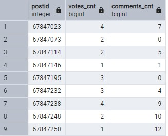
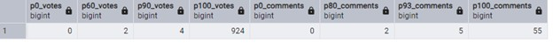
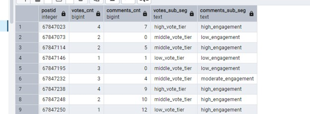
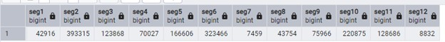
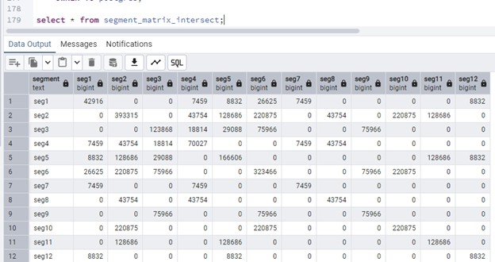
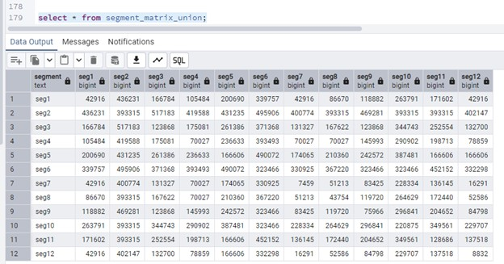
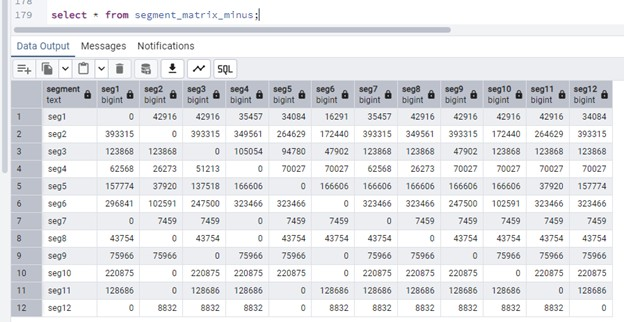

# Portfolio Entry #3

## Objective

Construct a segment set relationship matrix over a time-scoped population of posts. Segment membership is represented as boolean flags (sub-segments and derived compound segments). The final deliverable is a matrix that quantifies relationships between every pair of segments, including:

Intersection counts: |A ∩ B|

Union counts: |A ∪ B|

Set difference counts: |A \ B|

This matrix provides a high-level “map” of segment overlap, exclusivity, and subset relationships, and serves as a validation artifact for the segmentation rules.

Note: All of the diagrams you see here are generated using Maestro for PostgreSQL, their link https://www.sqlmaestro.com/products/postgresql/maestro/
## Diagrams & Graphs

Orignal
- 


## Step 1 — Count votes and comments for accepted answers in the one-year cohort

We count votes and comments for accepted answers to questions that were created within one year of the dataset’s maximum timestamp.  These counts will later be used to define vote-tier and comment-engagement sub-segments.

Cohort definition

Dataset max timestamp: 2022-06-05 06:39:59.28

Include only:

posts.posttypeid = 1 (questions)
posts.acceptedanswerid > 0 (question has an accepted answer)
posts.creationdate BETWEEN max_ts - interval '1 year' AND max_ts

Important:
The time filter applies to the question, not the answer.

The accepted answer is included if it belongs to a qualifying question, even if the answer itself was created outside the one-year window.
Cohort definition (time window on questions).
In the StackOverflow schema, both questions and answers are stored in posts table, votes are coming from the votes table and comments from comments table respectively. Questions are identified by posts.posttypeid = 1, and answered questions record an posts.acceptedanswerid. The dataset’s last available timestamp is 2022-06-05 06:39:59.28. The cohort is defined as answered questions created within the one-year window ending at that timestamp:

Implementation (materialize counts table).
The following query materializes a staging table with one row per accepted answer [votes or comments].postid = acceptedanswerid and two engagement metrics: total votes and total comments. Because both votes and comments are one-to-many relative to an answer, COUNT(DISTINCT ...) is used to prevent multiplicative inflation when joining both fact tables in a single query.
````sql
-- calculate counts for votes and comments for accepted answers
-- for questions created one year from the last date
-- last date is '2022-06-05 06:39:59.28'

DROP TABLE IF EXISTS votes_comments_per_answer_counts;

CREATE TEMP TABLE votes_comments_per_answer_counts AS
WITH params AS (
  SELECT timestamp '2022-06-05 06:39:59.28' AS max_ts
)
SELECT
  p.acceptedanswerid AS postid,
  COUNT(DISTINCT v.id) AS votes_cnt,
  COUNT(DISTINCT c.id) AS comments_cnt
FROM posts p
CROSS JOIN params
LEFT JOIN votes v
  ON v.postid = p.acceptedanswerid
LEFT JOIN comments c
  ON c.postid = p.acceptedanswerid
WHERE p.creationdate BETWEEN params.max_ts - interval '1 year' AND params.max_ts
  AND p.acceptedanswerid > 0
  AND p.posttypeid = 1
GROUP BY p.acceptedanswerid;
````

Output.
Step 1 produces votes_comments_per_answer_counts(postid, votes_cnt, comments_cnt), which Step 2 consumes to derive vote tiers and comment engagement tiers (the first-layer sub-segments).
- 

## Step 2 — Derive percentile-based sub-segments (vote tier + comment engagement)

With the base engagement counts available (votes_comments_per_answer_counts), the next step is to classify each accepted answer (answerid) into sub-segments. These sub-segments are the primitive building blocks used later to construct boolean segment membership and generate the segment relationship matrix.

Approach.
Sub-segment boundaries are derived from the empirical distribution of the cohort using percentile_disc. For transparency, the 0th and 100th percentiles are included alongside the internal cut points to make the full range explicit.

Vote tiers are defined using the 60th and 90th percentiles:

low_vote_tier: [p0, p60)

middle_vote_tier: [p60, p90)

high_vote_tier: [p90, p100]

Comment engagement tiers are defined using the 80th and 93rd percentiles:

low_engagement: [p0, p80)

moderate_engagement: [p80, p93)

high_engagement: [p93, p100]

Each answerid receives both a vote-tier label and a comment-engagement label, producing a compact categorical representation for downstream segment logic.

Implementation (materialize sub-segments table).
````sql
DROP TABLE IF EXISTS sub_segments;
CREATE TEMP TABLE sub_segments
AS
WITH percentiles AS (
SELECT
    percentile_disc(0.00) WITHIN GROUP (ORDER BY votes_cnt) AS p0_votes,
    percentile_disc(0.60) WITHIN GROUP (ORDER BY votes_cnt) AS p60_votes,
    percentile_disc(0.90) WITHIN GROUP (ORDER BY votes_cnt) AS p90_votes,
	  percentile_disc(1.00) WITHIN GROUP (ORDER BY votes_cnt) AS p100_votes,
	  percentile_disc(0.00) WITHIN GROUP (ORDER BY comments_cnt) AS p0_comments,
	  percentile_disc(0.80) WITHIN GROUP (ORDER BY comments_cnt) AS p80_comments,
    percentile_disc(0.93) WITHIN GROUP (ORDER BY comments_cnt) AS p93_comments,
	  percentile_disc(1.00) WITHIN GROUP (ORDER BY comments_cnt) AS p100_comments
  FROM votes_comments_per_answer_counts
 )
 	--Calculate sub-segments
SELECT  answerid,
		votes_cnt,
		comments_cnt,
CASE WHEN votes_cnt >=p0_votes AND votes_cnt < p60_votes THEN 'low_vote_tier'
     WHEN votes_cnt >= p60_votes AND votes_cnt < p90_votes THEN 'middle_vote_tier'
	 WHEN votes_cnt >= p90_votes AND votes_cnt <= p100_votes THEN 'high_vote_tier' END votes_sub_seg,
CASE WHEN comments_cnt >= p0_comments AND comments_cnt < p80_comments THEN 'low_engagement'
     WHEN comments_cnt >= p80_comments and comments_cnt < p93_comments THEN 'moderate_engagement'
	 WHEN comments_cnt >= p93_comments AND comments_cnt <= p100_comments THEN 'high_engagement' END comments_sub_seg	 
FROM votes_comments_per_answer_counts CROSS JOIN percentiles;
````
To make the tier boundaries explicit, the query below emits the percentile cut points used for classification. In the sample run shown here, the minimum values for both metrics were 0, but p0_* should be interpreted as the minimum observed count (not inherently “zero”).
- 

Output.
This step produces sub_segments(postid, votes_cnt, comments_cnt, votes_sub_seg, comments_sub_seg). These categorical sub-segments are used in the next section to define compound segments and produce boolean membership vectors suitable for matrix-based set operations.
- 

## Step 3 — Define sub-segment–based segment membership

With vote-tier and comment-engagement sub-segments established in Section 1, the next step is to define the logical segments that will be used to construct the relationship matrices. Each segment represents a boolean membership rule applied to the sub_segments table.

Two dimensions are available:

comments_sub_seg ∈ {low_engagement, moderate_engagement, high_engagement}

votes_sub_seg ∈ {low_vote_tier, middle_vote_tier, high_vote_tier}

From these, both primitive and compound segments are defined.

Primitive engagement segments

seg1 — High engagement
comments_sub_seg = 'high_engagement'

seg2 — Low engagement
comments_sub_seg = 'low_engagement'

seg3 — Moderate engagement
comments_sub_seg = 'moderate_engagement'

Primitive vote-tier segments

seg4 — High vote tier
votes_sub_seg = 'high_vote_tier'

seg5 — Low vote tier
votes_sub_seg = 'low_vote_tier'

seg6 — Middle vote tier
votes_sub_seg = 'middle_vote_tier'

Compound segments (engagement × vote-tier intersections)

seg7 — High engagement ∧ High vote tier
comments_sub_seg = 'high_engagement' AND votes_sub_seg = 'high_vote_tier'

seg8 — Low engagement ∧ High vote tier
comments_sub_seg = 'low_engagement' AND votes_sub_seg = 'high_vote_tier'

seg9 — Moderate engagement ∧ Middle vote tier
comments_sub_seg = 'moderate_engagement' AND votes_sub_seg = 'middle_vote_tier'

seg10 — Low engagement ∧ Middle vote tier
comments_sub_seg = 'low_engagement' AND votes_sub_seg = 'middle_vote_tier'

seg11 — Low engagement ∧ Low vote tier
comments_sub_seg = 'low_engagement' AND votes_sub_seg = 'low_vote_tier'

seg12 — High engagement ∧ Low vote tier
comments_sub_seg = 'high_engagement' AND votes_sub_seg = 'low_vote_tier'

These segment definitions form the boolean rules used later to build the segment intersection, union, and difference matrices.

## Step 4 — Materialize segment totals for matrix validation

Before generating pairwise segment relationship matrices, a baseline set of segment cardinalities is materialized for validation. These totals serve as a reference to confirm that each matrix diagonal equals the size of its corresponding segment (i.e., |A ∩ A| = |A|).
```sql
Implementation (segment totals check table)
-- this table holds totals for each defined segment
-- used later to validate matrix diagonals

DROP TABLE IF EXISTS segments_check;

CREATE TEMP TABLE segments_check AS
SELECT COUNT(CASE WHEN comments_sub_seg = 'high_engagement' THEN answerid END)  seg1,
		COUNT(CASE WHEN comments_sub_seg = 'low_engagement' THEN answerid END)  seg2,
		COUNT(CASE WHEN comments_sub_seg = 'moderate_engagement' THEN answerid END) seg3,
		COUNT(CASE WHEN votes_sub_seg = 'high_vote_tier' THEN answerid END) seg4,
		COUNT(CASE WHEN votes_sub_seg = 'low_vote_tier' THEN answerid END) seg5,
		COUNT(CASE WHEN votes_sub_seg = 'middle_vote_tier' THEN answerid END) seg6,
		COUNT(CASE WHEN comments_sub_seg = 'high_engagement' 
			AND votes_sub_seg = 'high_vote_tier' THEN answerid END) seg7,
		COUNT(CASE WHEN comments_sub_seg = 'low_engagement' 
			AND votes_sub_seg = 'high_vote_tier' THEN answerid END) seg8,
		COUNT(CASE WHEN comments_sub_seg = 'moderate_engagement' 
			AND votes_sub_seg = 'middle_vote_tier' THEN answerid END) seg9,
		COUNT(CASE WHEN comments_sub_seg = 'low_engagement' 
			AND votes_sub_seg = 'middle_vote_tier' THEN answerid END) seg10,
		COUNT(CASE WHEN comments_sub_seg = 'low_engagement' 
			AND votes_sub_seg = 'low_vote_tier' THEN answerid END) seg11,
		COUNT(CASE WHEN comments_sub_seg = 'high_engagement' 
			AND votes_sub_seg = 'low_vote_tier' THEN answerid END)	seg12
FROM sub_segments;
```
Sample output (segment cardinalities)
- 

These totals act as the expected diagonal values for the segment intersection matrix constructed in the next section.

## Step 5 — Generate segment relationship matrices (intersection, union, minus)

This section materializes the final deliverables of the entry: pairwise segment relationship matrices computed over the segment membership rules defined earlier. For each pair of segments (A as the row, B as the column), the matrix stores the count of distinct postid values that satisfy a chosen set operation.

Three operations are produced:

Intersection (A AND B) → segment_matrix_intersect

Union (A OR B) → segment_matrix_union

Set difference (A AND NOT B) → segment_matrix_minus

Approach

Instead of hard-coding a 12×12 matrix three times, a PL/pgSQL loop dynamically generates the required SQL:

Define a list of operations (AND, OR, AND NOT) and their output suffixes.

Define a segment dictionary mapping:

segment label (seg1..seg12)

boolean condition (e.g., comments_sub_seg = 'high_engagement')

For each operation:

Generate a wide “all pair counts” query (all_values_<op>) with columns like seg1_seg1, seg1_seg2, … seg12_seg12.

Reshape the wide result into a readable matrix table (segment_matrix_<op>) where:

rows are segment labels (seg1..seg12)

columns are segment labels (seg1..seg12)

cell values are the counts for that pair.

The resulting matrices are symmetric for intersection/union and generally non-symmetric for set difference (because A \ B ≠ B \ A).

Implementation
````sql
DO $$
DECLARE
  different_ops text[][] := ARRAY[
    ARRAY['AND',     'intersect'],
    ARRAY['OR',      'union'],
    ARRAY['AND NOT', 'minus']
  ];
  op text[];
  sql_string1 text;
  sql_string2 text;
BEGIN

  FOREACH op SLICE 1 IN ARRAY different_ops
  LOOP
    EXECUTE FORMAT('DROP TABLE IF EXISTS all_values_%s;', op[2]);
    EXECUTE FORMAT('DROP TABLE IF EXISTS segment_matrix_%s;', op[2]);

    -- 1st operation Build one wide row containing all pairwise counts for the operation
    WITH tab AS (
      SELECT conds, labels
      FROM (
        VALUES
          ('comments_sub_seg = ''high_engagement''',                                  'seg1'),
          ('comments_sub_seg = ''low_engagement''',                                   'seg2'),
          ('comments_sub_seg = ''moderate_engagement''',                              'seg3'),
          ('votes_sub_seg = ''high_vote_tier''',                                      'seg4'),
          ('votes_sub_seg = ''low_vote_tier''',                                       'seg5'),
          ('votes_sub_seg = ''middle_vote_tier''',                                    'seg6'),
          ('comments_sub_seg = ''high_engagement'' AND votes_sub_seg = ''high_vote_tier''',   'seg7'),
          ('comments_sub_seg = ''low_engagement''  AND votes_sub_seg = ''high_vote_tier''',   'seg8'),
          ('comments_sub_seg = ''moderate_engagement'' AND votes_sub_seg = ''middle_vote_tier''', 'seg9'),
          ('comments_sub_seg = ''low_engagement'' AND votes_sub_seg = ''middle_vote_tier''',  'seg10'),
          ('comments_sub_seg = ''low_engagement'' AND votes_sub_seg = ''low_vote_tier''',     'seg11'),
          ('comments_sub_seg = ''high_engagement'' AND votes_sub_seg = ''low_vote_tier''',    'seg12')
      ) val(conds, labels)
    )
    SELECT
      'SELECT ' ||
      STRING_AGG(
        'COUNT(DISTINCT CASE WHEN (' || tab1.conds || ') ' || op[1] || ' (' || tab2.conds || ') THEN answerid ELSE NULL END) AS ' ||
        tab1.labels || '_' || tab2.labels,
        ','
      ) ||
      ' FROM sub_segments;'
    INTO sql_string1
    FROM tab AS tab1, tab AS tab2;

    EXECUTE FORMAT('CREATE TEMP TABLE all_values_%s AS %s', op[2], sql_string1);

    -- 2nd operation Pivot the wide row into a readable matrix form
    WITH tab AS (
      SELECT val.col
      FROM (
        VALUES
          ('seg1'), ('seg2'), ('seg3'), ('seg4'), ('seg5'), ('seg6'),
          ('seg7'), ('seg8'), ('seg9'), ('seg10'), ('seg11'), ('seg12')
      ) AS val(col)
    ),
    qry1 AS (
      SELECT
        tab1.col AS col,
        STRING_AGG(tab1.col || '_' || tab2.col || ' AS ' || tab2.col, ',' ORDER BY REPLACE(tab2.col, 'seg', '')::int) AS counts
      FROM tab tab1, tab tab2
      GROUP BY tab1.col
      ORDER BY REPLACE(tab1.col, 'seg', '')::int
    )
    SELECT
      STRING_AGG(
        'SELECT ''' || col || ''' AS segment,' || counts || ' FROM all_values_' || op[2] || ' UNION ALL ',
        ''
      ) || 'SELECT ''' || col || ''' AS segment,' || counts || ' FROM all_values_' || op[2]
    INTO sql_string2
    FROM qry1;

    EXECUTE FORMAT('CREATE TABLE segment_matrix_%s AS %s', op[2], sql_string2);

  END LOOP;

END;
$$;
````
Dynamic SQL expansion (what the generator actually produces)

The matrix generator is implemented with dynamic SQL because the number of segments (and therefore matrix columns) is not fixed. With N segments, the wide intermediate table contains N×N columns (e.g., 12×12 = 144). In a real system, N can grow significantly, and the only practical approach is to generate the SQL programmatically.

To make this concrete, the code emits the generated SQL statements using RAISE NOTICE (or equivalent logging). Below is a truncated snapshot of the fully expanded SQL for the intersection operation.

Wide “all pair counts” table

The first operation from the do block above creates a single wide row containing all |A ∩ B| counts, one column per ordered segment pair (segX_segY).
````sql
NOTICE: CREATE TEMP TABLE all_values_intersect AS
SELECT
  COUNT(DISTINCT CASE WHEN (comments_sub_seg = 'high_engagement')
                       AND (comments_sub_seg = 'high_engagement')
                      THEN answerid ELSE NULL END) AS seg1_seg1,
  COUNT(DISTINCT CASE WHEN (comments_sub_seg = 'high_engagement')
                       AND (comments_sub_seg = 'low_engagement')
                      THEN answerid ELSE NULL END) AS seg1_seg2,
  COUNT(DISTINCT CASE WHEN (comments_sub_seg = 'high_engagement')
                       AND (comments_sub_seg = 'moderate_engagement')
                      THEN answerid ELSE NULL END) AS seg1_seg3,
  ...
  COUNT(DISTINCT CASE WHEN (comments_sub_seg = 'high_engagement' AND votes_sub_seg = 'low_vote_tier')
                       AND (comments_sub_seg = 'high_engagement' AND votes_sub_seg = 'low_vote_tier')
                      THEN answerid ELSE NULL END) AS seg12_seg12
FROM sub_segments;
````
The second operation from the do block above pivot wide row into readable matrix form

The wide table (all_values_intersect) is then reshaped into a standard matrix layout with one row per segment and one column per segment. The dynamic SQL builds a UNION ALL chain that maps the correct set of segX_segY columns into a row labeled segX.
````sql
NOTICE: CREATE TABLE segment_matrix_intersect AS
SELECT 'seg1' AS segment,
       seg1_seg1 AS seg1, seg1_seg2 AS seg2, seg1_seg3 AS seg3, ... , seg1_seg12 AS seg12
FROM all_values_intersect
UNION ALL
SELECT 'seg2' AS segment,
       seg2_seg1 AS seg1, seg2_seg2 AS seg2, seg2_seg3 AS seg3, ... , seg2_seg12 AS seg12
FROM all_values_intersect
UNION ALL
...
UNION ALL
SELECT 'seg12' AS segment,
       seg12_seg1 AS seg1, seg12_seg2 AS seg2, seg12_seg3 AS seg3, ... , seg12_seg12 AS seg12
FROM all_values_intersect;
````
Key point: this pivot step is also automatically generated from the segment list, so adding segments automatically expands both the wide count table and the final matrix shape.

Practical implication

This technique generalizes cleanly:

If the segment dictionary grows from 12 → 40 segments:

The matrix grows from 144 → 1600 pairwise relationships.
(Note: As of current use of this version 14, the column limit is set to 1600 that means the max number of segments possible using this approach is 40.  However I am sure it is possible to implement even more segments (1600) using string concatenation and regular expression tricks.)

The code does not change; only the dictionary changes.

Output.
This step produces the three final matrix tables:

segment_matrix_intersect — |A ∩ B|
- 

segment_matrix_union — |A ∪ B|
- 

segment_matrix_minus — |A \ B|
- 

These are the core artifacts referenced throughout the analysis and are validated using the totals table from Step 4 (diagonal checks) [Go to Step 4](#step-4--materialize-segment-totals-for-matrix-validation) and symmetry expectations (where applicable).

Sample output (intersection matrix)

The segment_matrix_intersect table stores pairwise intersection counts 
∣A∩B∣
∣A∩B∣ between every segment (rows = A, columns = B). The diagonal represents each segment’s cardinality because 
∣A∩A∣=∣A∣
∣A∩A∣=∣A∣. Off-diagonal values quantify overlap; zeros indicate disjoint segments.

segment  seg1   seg2    seg3    seg4   seg5    seg6    seg7  seg8   seg9   seg10   seg11   seg12
seg1     42916  0       0       7459   8832    26625   7459  0      0      0       0       8832
seg2     0      393315  0       43754  128686  220875  0     43754  0      220875  128686  0
seg3     0      0       123868  18814  29088   75966   0     0      75966  0       0       0
seg4     7459   43754   18814   70027  0       0       7459  43754  0      0       0       0
seg5     8832   128686  29088   0      166606  0       0     0      0      0       128686  8832
seg6     26625  220875  75966   0      0       323466  0     0      75966  220875  0       0
seg7     7459   0       0       7459   0       0       7459  0      0      0       0       0
seg8     0      43754   0       43754  0       0       0     43754  0      0       0       0
seg9     0      0       75966   0      0       75966   0     0      75966  0       0       0
seg10    0      220875  0       0      0       220875  0     0      0      220875  0       0
seg11    0      128686  0       0      128686  0       0     0      0      0       128686  0
seg12    8832   0       0       0      8832    0       0     0      0      0       0       8832

Interpretation notes.

Diagonal check: each diagonal value matches the corresponding segment total in segments_check (
∣A∩A∣=∣A∣
∣A∩A∣=∣A∣).

Partition behavior: segments that represent mutually exclusive tiers show zero overlap (e.g., seg1 vs seg2, seg4 vs seg5).

Compound segments: rows such as seg7, seg8, seg9, etc. behave as expected subsets of their component primitive segments (e.g., seg7 ⊆ seg1 and seg7 ⊆ seg4).

If you want one extra “QA sentence” that’s worth adding right after this sample:

The matrix is symmetric for intersection (
∣A∩B∣=∣B∩A∣
∣A∩B∣=∣B∩A∣), providing an additional integrity check on the generated results.

Also mention how the diagnal matches our totals in this case.

Add this directly under the sample matrix in Section 5:

Diagonal validation against segment totals.
Each diagonal entry in the intersection matrix represents 
∣A∩A∣
∣A∩A∣, which by definition must equal the total size of segment A. These values match exactly with the precomputed totals stored in the segments_check table from Section 3:

seg1 diagonal = 42,916 → matches total high-engagement count

seg2 diagonal = 393,315 → matches total low-engagement count

seg3 diagonal = 123,868 → matches total moderate-engagement count

seg4 diagonal = 70,027 → matches total high-vote-tier count

seg5 diagonal = 166,606 → matches total low-vote-tier count

seg6 diagonal = 323,466 → matches total middle-vote-tier count

seg7–seg12 diagonals similarly match their respective compound segment totals

This equality confirms that segment membership was computed consistently and that the matrix generation logic correctly preserves set identity (
∣A∩A∣=∣A∣
∣A∩A∣=∣A∣).

Union matrix (|A ∪ B|)

The union matrix stores pairwise union counts between segments. Each cell represents the number of distinct postid values that belong to either segment A or segment B.

[union matrix table as shown]

Interpretation.

Union identity on diagonal.
The diagonal represents 
∣A∪A∣
∣A∪A∣, which must equal 
∣A∣
∣A∣. As expected, each diagonal value matches the corresponding segment total from segments_check.

Union relationship.
For any pair of segments A and B:

∣A∪B∣=∣A∣+∣B∣−∣A∩B∣
∣A∪B∣=∣A∣+∣B∣−∣A∩B∣

The union matrix therefore acts as a secondary integrity check when compared with the intersection matrix and the segment totals.

Superset behavior.
When one segment is a subset of another (e.g., compound segments within primitive tiers), the union collapses to the larger segment’s size. This behavior is visible in rows such as seg7 vs seg1 and seg4.

Set difference matrix (A − B)

The minus matrix stores directional set differences. Each cell represents:

∣A∖B∣=count of postids in A but not in B
∣A∖B∣=count of postids in A but not in B
[minus matrix table as shown]

Key validation properties.

Zero diagonals.
The diagonal is zero for all segments because:

∣A∖A∣=0
∣A∖A∣=0

This confirms that the subtraction logic is implemented correctly.

Directional behavior.
Unlike intersection and union, the minus matrix is not symmetric:

∣A∖B∣≠∣B∖A∣
∣A∖B∣

=∣B∖A∣

This is expected and provides insight into subset relationships.
For example, if segment B is largely contained within segment A, then:

∣B∖A∣
∣B∖A∣ will be small or zero

∣A∖B∣
∣A∖B∣ will be relatively large

Consistency with intersection totals.
Each cell also satisfies:

∣A∣=∣A∩B∣+∣A∖B∣
∣A∣=∣A∩B∣+∣A∖B∣

Comparing rows of the minus matrix with the corresponding rows of the intersection matrix provides another internal consistency check across all derived segment relationships.

Summary of matrix validation checks

Across the three matrices:

Intersection diagonal = segment totals

Union diagonal = segment totals

Minus diagonal = 0

Intersection matrix symmetric

Union matrix symmetric

Minus matrix directional but consistent with identity

∣A∣=∣A∩B∣+∣A∖B∣
∣A∣=∣A∩B∣+∣A∖B∣

Together, these confirm correctness of the segment membership logic and matrix construction.


