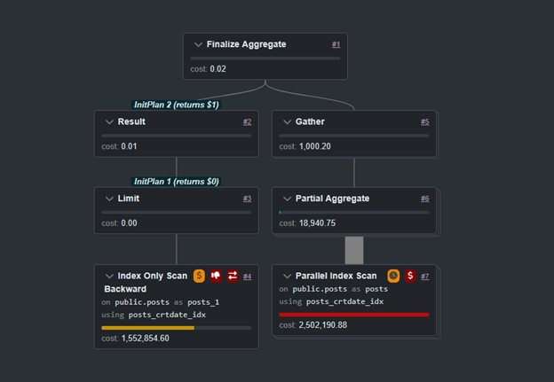

## Entry 04 — Finding MAX(lastactivitydate) Without an Index
Problem

The posts table contains two timestamps:

creationdate

lastactivitydate

In analytical queries we sometimes need to compute:

SELECT MAX(lastactivitydate)
FROM posts;

However, the table does not have an index on lastactivitydate.

On large datasets this forces PostgreSQL to perform a sequential scan across the entire table, which can be extremely expensive and potentially disruptive to other workloads.

Creating an index on lastactivitydate is not feasible because:

the table is very large

the index would consume significant disk space

maintenance overhead would increase

Therefore, we need a way to compute the maximum value without indexing the column directly.

Observed Data Property

The dataset follows an important constraint:

lastactivitydate >= creationdate

This means a row’s activity timestamp is never earlier than when the post was created.

Importantly, creationdate already has an index.

This allows us to use creationdate as a proxy for recency.

Approach 1 — No Backfills

If the system never inserts late records (no historical backfills), then the most recent activity must occur near the newest creation time.

In that case we can query:

SELECT lastactivitydate
FROM posts
ORDER BY creationdate DESC, lastactivitydate DESC
LIMIT 1;
Why this works

PostgreSQL can use the index on creationdate

the query starts from the newest rows

execution stops immediately due to LIMIT 1

Instead of scanning the entire table, the database only examines a very small portion of the index tail.

Approach 2 — Per-Post Version Chains

In some systems the assumption only holds within a single post ID, where multiple versions or updates exist.

For example:

post_id | creationdate | lastactivitydate

In this case the optimization becomes:

SELECT lastactivitydate
FROM posts
WHERE id = ?
ORDER BY creationdate DESC, lastactivitydate DESC
LIMIT 1;

This returns the newest version of the post and therefore the correct lastactivitydate.  However it is unreliable since one postid may not show us the overall maximum of lastactivitydate.

Approach 3 — Handling Late Backfills

Real production systems sometimes ingest late-arriving data.

If historical rows can arrive after the fact, the previous query may miss the true maximum.

However, if the system guarantees a bounded backfill window (for example, late data may arrive within one year), we can restrict the search space.
````sql
WITH params AS (
    SELECT '1 year'::interval AS backfill_limit
)
SELECT MAX(lastactivitydate)
FROM posts
CROSS JOIN params
WHERE creationdate >
      (SELECT MAX(creationdate) FROM posts) - backfill_limit;
````      
Execution characteristics

This query performs two index-friendly operations:

Find the latest creationdate

Perform an index range scan on recent rows only

The database then computes MAX(lastactivitydate) on this reduced candidate set rather than scanning the entire table.

Why This Optimization Matters

Without optimization:

MAX(lastactivitydate)
→ full table scan
→ expensive on large datasets

With the proxy strategy:

index scan on creationdate
→ examine only recent rows
→ aggregate lastactivitydate on small subset

This converts a potentially destructive sequential scan into a bounded index-driven query.

The execution plan that performs two index scans taken from website https://explain.dalibo.com/ looks like this:

- 

Key Idea

When an important column cannot be indexed due to size or cost, query performance can sometimes be recovered by:

identifying a related indexed column

exploiting known data constraints

reducing the search space before aggregation

In this case:

creationdate index
+
lastactivitydate ≥ creationdate constraint

allowed the query planner to avoid scanning the entire table.