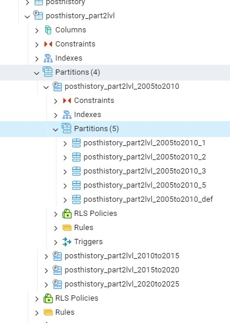
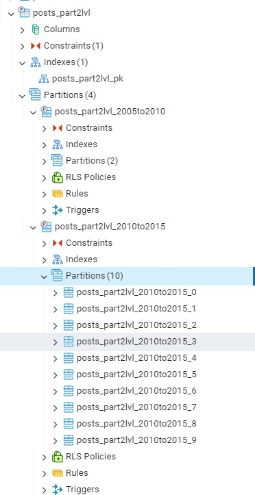
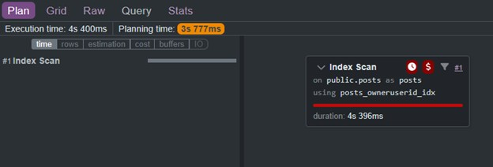
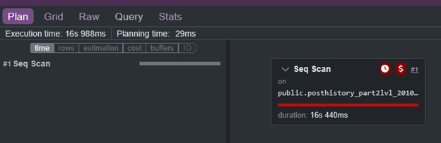

# Table Optimization for Large Datasets Using Multi-Level Partitioning

Suppose the posts table is queried primarily by creationdate and owneruserid, and the posthistory table is queried primarily by creationdate and posthistorytypeid. If these predicates represent the majority of workload (for example, roughly 95% of queries), organizing the tables to align with these columns can significantly improve performance.

In this entry, both tables are optimized using multi-level partitioning. The posts table is partitioned by range on creationdate and subpartitioned by hash on owneruserid, while the posthistory table is partitioned by range on creationdate and subpartitioned by list on posthistorytypeid.  You can see a sample visual representations below.
- 
- 

We then compare the query performance of these partitioned tables against equivalent non-partitioned tables, demonstrating how aligning table structure with the most common query predicates can reduce the amount of data PostgreSQL must scan and improve execution time.

The posthistory table is partitioned by range on creationdate and subpartitioned by list on posthistorytypeid. To determine how these list partitions should be structured, the distribution of posthistorytypeid values was first examined.

The following query shows the row counts for each history type:
````sql
select posthistorytypeid, count(*) cnt
from posthistory
group by posthistorytypeid;
````
The results show that the majority of rows are concentrated in a small number of history types:
````sql
posthistorytypeid	cnt
1	19474712
2	48930290
3	19452418
4	2969847
5	29043379
6	4121449
7	27490
8	126179
9	23152
10	917489
11	61713
12	404281
13	409388
14	5607
15	3275
16	113586
19	39735
20	1148
22	47
24	3194572
33	208722
34	207431
35	1277
36	20767
37	1634
38	6713
50	150101
````
From this distribution it becomes clear that four types dominate the table:

1

2

3

5

To better understand their relative weight compared to the remaining types, the counts can be grouped into major and minor categories:
````sql
select posthistorytypeid::char, count(*) cnt
from posthistory
where posthistorytypeid in (1,2,3,5)
group by posthistorytypeid

union all

select 'def', count(*)
from posthistory
where posthistorytypeid not in (1,2,3,5)

order by 1;
````
The results show the following distribution:
````sql
posthistorytypeid	cnt
1	19474712
2	48930290
3	19452418
5	29043379
def	13015603
````
This confirms that the majority of the dataset is concentrated in these four types, while the remaining values collectively represent a much smaller portion of the table.

Based on this analysis, the list subpartitioning strategy for posthistory was designed as follows:

dedicated partitions for posthistorytypeid 1

dedicated partitions for posthistorytypeid 2

dedicated partitions for posthistorytypeid 3

dedicated partitions for posthistorytypeid 5

a DEFAULT partition containing all remaining history types

This approach isolates the largest categories of history events into their own partitions while avoiding the overhead of maintaining many small partitions for rarely occurring types.

By combining range partitioning on creationdate with targeted subpartitioning, the tables are structured so that PostgreSQL can operate on smaller subsets of data during query execution. The following sections compare the performance of these partitioned tables with equivalent non-partitioned tables to demonstrate the impact of this design.

# Creating the `posthistory` Multi-Level Partitioned Table

After determining that the `posthistory` table should be partitioned by **range on `creationdate`** and subpartitioned by **list on `posthistorytypeid`**, the next step was to generate the table structure.

The parent table was created dynamically from `information_schema.columns` so the new partitioned table would mirror the original `posthistory` column layout. The following block builds and executes a `DROP TABLE IF EXISTS` statement followed by a `CREATE TABLE` statement for the partitioned parent:

```sql
DO $$
DECLARE
    stmnt1 text;
    stmnt2 text;
BEGIN
    FOR stmnt1, stmnt2 IN
        SELECT
            'DROP TABLE IF EXISTS ' || table_name || '_part2lvl;',
            'CREATE TABLE ' || table_name || E'_part2lvl (\n' ||
            string_agg(
                '    ' || column_name || ' ' ||
                CASE
                    WHEN column_name = 'id' THEN 'BIGSERIAL'
                    ELSE data_type
                END ||
                CASE
                    WHEN character_maximum_length IS NOT NULL
                        THEN '(' || character_maximum_length || ')'
                    ELSE ''
                END ||
                CASE
                    WHEN is_nullable = 'NO' AND column_name <> 'id'
                        THEN ' NOT NULL'
                    ELSE ''
                END,
                E',\n'
                ORDER BY ordinal_position ASC
            ) ||
            E'\n) PARTITION BY RANGE (creationdate);'
        FROM information_schema.columns
        WHERE table_name IN ('posthistory')
          AND table_schema = 'public'
        GROUP BY table_schema, table_name
    LOOP
        EXECUTE stmnt1;
        EXECUTE stmnt2;
    END LOOP;
END;
$$;
```

This produced the following parent table definition:

```sql
CREATE TABLE posthistory_part2lvl (
    id BIGSERIAL,
    posthistorytypeid integer,
    postid integer,
    revisionguid uuid,
    creationdate timestamp without time zone,
    userid integer,
    userdisplayname character varying(40),
    comment text,
    text text
) PARTITION BY RANGE (creationdate);
```

This parent table acts as the top-level container for all `posthistory` data. The first partitioning level is based on `creationdate`, which allows PostgreSQL to prune entire time ranges when queries restrict the date.

---

# Creating Range Partitions and List Subpartitions

Once the parent table was created, a second PL/pgSQL block generated the child partitions. The design uses:

- **5-year range partitions** on `creationdate`
- **list subpartitions** on `posthistorytypeid`
- dedicated subpartitions for values `1`, `2`, `3`, and `5`
- a `DEFAULT` subpartition for all other values

The following block creates that structure:

```sql
DO $$
DECLARE
    start_dt timestamp;
    end_dt   timestamp;
    yr       text;
    tbl      text;
    partlist int;
BEGIN
    FOREACH tbl IN ARRAY ARRAY['posthistory']
    LOOP
        FOR start_dt, end_dt, yr IN
            SELECT
                g.dt,
                g.dt + interval '5 years',
                to_char(g.dt, 'YYYY')
            FROM generate_series(
                '2005-01-01'::date,
                '2020-01-01'::date,
                '5 years'
            ) AS g(dt)
        LOOP
            EXECUTE format(
                'CREATE TABLE %s_part2lvl_%sto%s PARTITION OF %s_part2lvl FOR VALUES FROM (%L) TO (%L) PARTITION BY LIST(posthistorytypeid);',
                tbl, yr, yr::int + 5, tbl, start_dt, end_dt
            );

            FOREACH partlist IN ARRAY ARRAY[1, 2, 3, 5]
            LOOP
                EXECUTE format(
                    'CREATE TABLE %s_part2lvl_%sto%s_%s PARTITION OF %s_part2lvl_%sto%s FOR VALUES IN (%L);',
                    tbl, yr, yr::int + 5, partlist, tbl, yr, yr::int + 5, partlist
                );
            END LOOP;

            EXECUTE format(
                'CREATE TABLE %s_part2lvl_%sto%s_def PARTITION OF %s_part2lvl_%sto%s DEFAULT;',
                tbl, yr, yr::int + 5, tbl, yr, yr::int + 5
            );
        END LOOP;
    END LOOP;
END;
$$;
```

This produces the following partition hierarchy for each 5‑year time window:

- A **range partition** for the date interval
- Four **list subpartitions** for `posthistorytypeid` values `1`, `2`, `3`, and `5`
- One **DEFAULT partition** for all other history types

Example generated structure:

```text
posthistory_part2lvl_2005to2010
 ├── posthistory_part2lvl_2005to2010_1
 ├── posthistory_part2lvl_2005to2010_2
 ├── posthistory_part2lvl_2005to2010_3
 ├── posthistory_part2lvl_2005to2010_5
 └── posthistory_part2lvl_2005to2010_def
```

The same pattern is repeated for the following date ranges:

- `2010–2015`
- `2015–2020`
- `2020–2025`

---

# Design Rationale

This structure follows directly from the earlier data distribution analysis.

Since the `posthistory` table is commonly queried by:

- `creationdate`
- `posthistorytypeid`

it makes sense to partition first by time and then by history type.

The **range partitions** isolate large time windows, allowing PostgreSQL to prune entire partitions when a query restricts `creationdate`.

Within each time range, the most common `posthistorytypeid` values (`1`, `2`, `3`, and `5`) receive dedicated subpartitions because they represent the majority of rows in the dataset. Less common values are grouped into a single `DEFAULT` partition to avoid creating many small partitions that would add complexity without meaningful benefit.

This approach balances:

- efficient **partition pruning**
- isolation of the **largest categories**
- reduced **partition management overhead**

Adding the Primary Key Constraint

Once the partition hierarchy was created, a primary key was added to the partitioned parent table:
````sql
ALTER TABLE posthistory_part2lvl
ADD CONSTRAINT posthistory_part2lvl_pk
PRIMARY KEY (creationdate, posthistorytypeid, id);
````
Because PostgreSQL requires a PRIMARY KEY or UNIQUE constraint on a partitioned table to include all partitioning columns, the key cannot be defined on id alone. The table is partitioned first by creationdate (range partition) and then by posthistorytypeid (list subpartition), so both columns must be included in the key definition in order for PostgreSQL to enforce global uniqueness across all partitions.

The final key therefore consists of:

creationdate

posthistorytypeid

id

The id column remains the row identifier, while the partition columns ensure that uniqueness can be enforced across the entire partitioned structure.

In addition to enforcing row uniqueness, this constraint also creates the primary index used by the dominant query path. Since the posthistory workload is primarily filtered by creationdate and posthistorytypeid, placing these columns at the beginning of the primary key allows PostgreSQL to efficiently navigate the partitioned structure and locate the relevant rows. The index therefore serves both as the logical primary key and as the primary access path for the most common query predicates.

Comparing Query Performance for a Large Return Set

To evaluate the effect of the partitioned design, the same query was executed against both the original posthistory table and the partitioned posthistory_part2lvl table.

The query filters by:

a 5-year creationdate range

posthistorytypeid = 2

This is an appropriate test case because the predicates align directly with the partitioning structure and the query returns a large number of rows.

Query against the original table
````sql
EXPLAIN (VERBOSE, FORMAT JSON, ANALYZE, COSTS, TIMING, BUFFERS)
SELECT *
FROM posthistory
WHERE creationdate >= '2010-01-01 00:00:00'
  AND creationdate <  '2015-01-01 00:00:00'
  AND posthistorytypeid = 2;
````
PostgreSQL executed this query using a Bitmap Index Scan followed by a Bitmap Heap Scan on the index (creationdate, posthistorytypeid). The query returned approximately 20.2 million rows and the full operation completed in about 36.680 seconds.
## - 
Query against the partitioned table
````sql
EXPLAIN (VERBOSE, FORMAT JSON, ANALYZE, COSTS, TIMING, BUFFERS)
SELECT *
FROM posthistory_part2lvl
WHERE creationdate >= '2010-01-01 00:00:00'
  AND creationdate <  '2015-01-01 00:00:00'
  AND posthistorytypeid = 2;
````
For the partitioned table, PostgreSQL pruned the query to the specific child partition:

posthistory_part2lvl_2010to2015_2
- 

The optimizer then performed a sequential scan on that partition, returning approximately 20.2 million rows in about 16.440 seconds.

Result

As shown by the execution plans, the partitioned table reduced runtime for this large-result query from approximately 36.680 seconds to 16.440 seconds, reducing execution time by about 55%.

The performance improvement occurs because the partitioned design allows PostgreSQL to eliminate irrelevant data segments and operate directly on the targeted partition that satisfies both predicates (creationdate and posthistorytypeid). For large result sets such as this one, scanning a single pruned partition is significantly cheaper than executing an index-driven plan against a much larger monolithic table.

# Creating the Partitioned Parent Table for posts

With the partitioning strategy established, the next step was to create a new partitioned version of the posts table. As with the earlier posthistory work, this was done dynamically rather than by manually rewriting the schema column by column.

The following PL/pgSQL block reads the column metadata for public.posts from information_schema.columns, constructs a DROP TABLE IF EXISTS statement for cleanup, and then generates a CREATE TABLE statement for a new partitioned table named posts_part2lvl:
````sql
DO $$
DECLARE

stmnt1 text;
stmnt2 text;
BEGIN
FOR stmnt1,stmnt2 IN

SELECT 'DROP TABLE IF EXISTS ' || table_name || '_part2lvl;',
  'CREATE TABLE ' || table_name || E'_part2lvl (\n' ||
  string_agg(
    '    ' || column_name || ' ' || CASE WHEN column_name ='id' THEN 'BIGSERIAL' ELSE data_type END ||
    CASE 
      WHEN character_maximum_length IS NOT NULL THEN '(' || character_maximum_length || ')'
      ELSE ''
    END ||
    CASE 
      WHEN is_nullable = 'NO' AND column_name <> 'id' THEN ' NOT NULL' 
      ELSE ''
    END
    , E',\n' ORDER BY ordinal_position ASC
  ) || E'\n) PARTITION BY RANGE(creationdate) ;'
FROM information_schema.columns
WHERE table_name IN ('posts')
  AND table_schema = 'public'
GROUP BY table_schema, table_name
LOOP 
RAISE NOTICE '%',stmnt1;
EXECUTE stmnt1;
RAISE NOTICE '%',stmnt2;
EXECUTE stmnt2;
END LOOP;
END ;
$$;
````
This produced the following parent table definition:
````sql
CREATE TABLE posts_part2lvl (
    id BIGSERIAL,
    acceptedanswerid integer,
    answercount integer,
    body text,
    closeddate timestamp without time zone,
    commentcount integer,
    communityowneddate timestamp without time zone,
    creationdate timestamp without time zone,
    favoritecount integer,
    lastactivitydate timestamp without time zone,
    lasteditdate timestamp without time zone,
    lasteditordisplayname character varying(40),
    lasteditoruserid integer,
    owneruserid integer,
    parentid integer,
    posttypeid integer,
    score integer,
    tags character varying(150),
    title character varying(250),
    viewcount integer
) PARTITION BY RANGE(creationdate);
````
At this stage, the goal was not yet to create the full physical partition tree, but to establish the partitioned parent structure first. This mirrors the same staged approach used in the posthistory implementation: define the parent table, confirm that the schema is reproduced correctly, and only then proceed to the child partition layout and supporting indexes.  

Sizing the posts Subpartition Layout by Time Range

After creating the partitioned parent table, the next step was to determine how aggressively each 5-year range should be subpartitioned by owneruserid. Unlike a uniform design, posts is not distributed evenly across time, so applying the same hash modulus to every range would have been arbitrary and inefficient.

To measure the distribution, I first checked the row counts for each 5-year creationdate window:

SELECT '2005-01-01 00:00:00' strt_rng,COUNT(*)
FROM posts
WHERE creationdate >= '2005-01-01 00:00:00' AND creationdate < '2010-01-01 00:00:00'
UNION ALL
SELECT '2010-01-01 00:00:00',COUNT(*)
FROM posts
WHERE creationdate >= '2010-01-01 00:00:00' AND creationdate < '2015-01-01 00:00:00'
UNION ALL
SELECT '2015-01-01 00:00:00',COUNT(*)
FROM posts
WHERE creationdate >= '2015-01-01 00:00:00' AND creationdate < '2020-01-01 00:00:00'
UNION ALL
SELECT '2020-01-01 00:00:00',COUNT(*)
FROM posts
WHERE creationdate >= '2020-01-01 00:00:00' AND creationdate < '2025-01-01 00:00:00';

This returned:

2005-01-01 00:00:00    1,348,178
2010-01-01 00:00:00   20,218,550
2015-01-01 00:00:00   23,578,702
2020-01-01 00:00:00    9,403,887

The distribution is heavily skewed toward the middle ranges. Because of that, I did not use a single fixed modulus for all second-level partitions. Instead, I assigned subpartition counts based on relative volume:

2005–2010: 2 hash subpartitions

2010–2015: 10 hash subpartitions

2015–2020: 10 hash subpartitions

2020–2025: 5 hash subpartitions

This produced a more balanced physical layout without over-partitioning the smallest historical range.

Creating the Range Partitions

The first step was to create the 5-year creationdate partitions under posts_part2lvl, with each of those partitions declared as hash-partitioned by owneruserid:

DO $$
DECLARE
start_dt timestamp;
end_dt timestamp;
yr text;
tbl text;
partlist int;
BEGIN

FOREACH tbl IN ARRAY ARRAY['posts']
LOOP

    FOR start_dt, end_dt,yr IN
    SELECT g.dt, g.dt + interval '5 years',to_char(g.dt,'YYYY')
    FROM generate_series('2005-01-01'::date,'2020-01-01'::date,'5 years') AS g(dt)
    LOOP

        RAISE NOTICE '%', format(
            'CREATE TABLE %s_part2lvl_%sto%s PARTITION OF %s_part2lvl FOR VALUES FROM (%L) TO (%L) PARTITION BY HASH(owneruserid);;',
            tbl,yr,yr::int+5,tbl,start_dt,end_dt
        );

        EXECUTE format(
            'CREATE TABLE %s_part2lvl_%sto%s PARTITION OF %s_part2lvl FOR VALUES FROM (%L) TO (%L) PARTITION BY HASH(owneruserid);',
            tbl,yr,yr::int+5,tbl,start_dt,end_dt
        );

    END LOOP;
END LOOP;
END;
$$;

This produced the expected first-level range partitions:

posts_part2lvl_2005to2010
posts_part2lvl_2010to2015
posts_part2lvl_2015to2020
posts_part2lvl_2020to2025

Each one covered a fixed creationdate range and was prepared to receive a different number of hash subpartitions on owneruserid.

Creating the Hash Subpartitions

With the range partitions in place, I then generated the second-level hash partitions. The modulus for each 5-year range was chosen dynamically from the year embedded in the table name:

DO $$
DECLARE
tbl text;
mod text;
rm text;
BEGIN
FOR tbl,mod,rm
IN
WITH yrs AS
(
    SELECT tablename,substring(tablename from 'posts_part2lvl_([0-9]+)to[0-9]+$')::int st_yr
        FROM pg_tables
    WHERE schemaname = 'public' AND tablename ~ 'posts_part2lvl_[0-9]+to[0-9]+$'
), cuts AS
(
    SELECT tablename,
           CASE
               WHEN st_yr = 2005 THEN 2
               WHEN st_yr = 2020 THEN 5
               ELSE 10
           END AS modulus
    FROM yrs
)
SELECT tablename,modulus, rem.i - 1 AS rem
FROM cuts
INNER JOIN LATERAL generate_series(1,modulus,1) AS rem(i) ON TRUE
LOOP
    RAISE NOTICE '%',format(
        'CREATE TABLE %s_%s PARTITION OF %s for values with (modulus %s, remainder %s);',
        tbl,rm,tbl,mod,rm
    );

    EXECUTE format(
        'CREATE TABLE %s_%s PARTITION OF %s for values with (modulus %s, remainder %s);',
        tbl,rm,tbl,mod,rm
    );
END LOOP;
END;
$$;

The intended result was a non-uniform hash layout:

posts_part2lvl_2005to2010: 2 subpartitions

posts_part2lvl_2010to2015: 10 subpartitions

posts_part2lvl_2015to2020: 10 subpartitions

posts_part2lvl_2020to2025: 5 subpartitions

That design matches the underlying row counts much more closely than a one-size-fits-all modulus.

What Happened in Practice

The output shows an important side effect of the metadata query: it matched not only the intended 5-year range partitions, but also the hash partitions that had just been created. As a result, the second block continued generating partitions beneath partitions that were already leaf partitions, producing names such as:

posts_part2lvl_2005to2010_0_0
posts_part2lvl_2010to2015_3_7
posts_part2lvl_2020to2025_4_4

That was not the intended final layout. The target design was two levels only:

range partition on creationdate

hash subpartition on owneruserid

Instead, the pattern used against pg_tables was broad enough to re-select child partitions and effectively recurse the naming convention one level further. In other words, the generation logic worked mechanically, but the table-selection filter was too loose.

The correct implementation should restrict the second pass to only the immediate range partitions, not every table whose name begins with posts_part2lvl_.

Design Rationale

Despite the over-generation in this draft, the architectural decision itself was deliberate. creationdate provides strong pruning for time-based scans, while owneruserid distributes large date ranges into smaller physical units that can reduce scan scope for owner-focused or mixed filters. Because the volume of posts changes significantly across time, using different hash counts by range avoids both extremes:

under-partitioning the heaviest windows

over-partitioning the smallest historical slice

This made posts a better candidate for uneven second-level partitioning than posthistory, where the distribution and access pattern were different.

Testing owneruserid Access Within a Time Range

With the second partitioning level in place, I then tested a query pattern that combines both partition dimensions: a creationdate range filter together with a specific owneruserid.

To make the comparison meaningful, I used one of the most prolific owners in the dataset, owneruserid = 22656, and ran the same query against both the original posts table and the partitioned posts_part2lvl table:

EXPLAIN (VERBOSE, FORMAT JSON, ANALYZE, COSTS, TIMING, BUFFERS)
SELECT *
FROM posts
WHERE creationdate >= '2010-01-01 00:00:00'
  AND creationdate <  '2015-01-01 00:00:00'
  AND owneruserid = 22656;
EXPLAIN (VERBOSE, FORMAT JSON, ANALYZE, COSTS, TIMING, BUFFERS)
SELECT *
FROM posts_part2lvl
WHERE creationdate >= '2010-01-01 00:00:00'
  AND creationdate <  '2015-01-01 00:00:00'
  AND owneruserid = 22656;

The original posts table completed in roughly 4.4 seconds, while the partitioned version completed in about 2.17 seconds.

This reduced execution time by approximately 50.6%, saving about 2.23 seconds on the same query.

Why the Partitioned Version Was Faster

The improvement came from the query being able to benefit from both levels of the partition design:

the creationdate predicate pruned the scan down to the 2010–2015 range partition

the owneruserid hash partitioning narrowed the scan further to the relevant subpartition within that range

Instead of scanning through a much larger portion of the original table using the general owneruserid index, PostgreSQL was able to operate against a much smaller physical segment of the data.

In the test output, the non-partitioned table used an index scan on posts_owneruserid_idx and still required roughly 4.4 seconds to complete. The partitioned table, by contrast, was able to execute against a single targeted child partition in the 2010–2015 range and finished in about 2.17 seconds.

This is the kind of query pattern the two-level design was meant to improve: not just broad date filtering, but selective lookups where time and owner are both available.

Result

For owner-based lookups constrained to a known date window, the two-level partitioned design cut execution time by roughly half. That result shows that the added partitioning complexity was not just structural experimentation; it produced a measurable gain on a realistic access pattern.