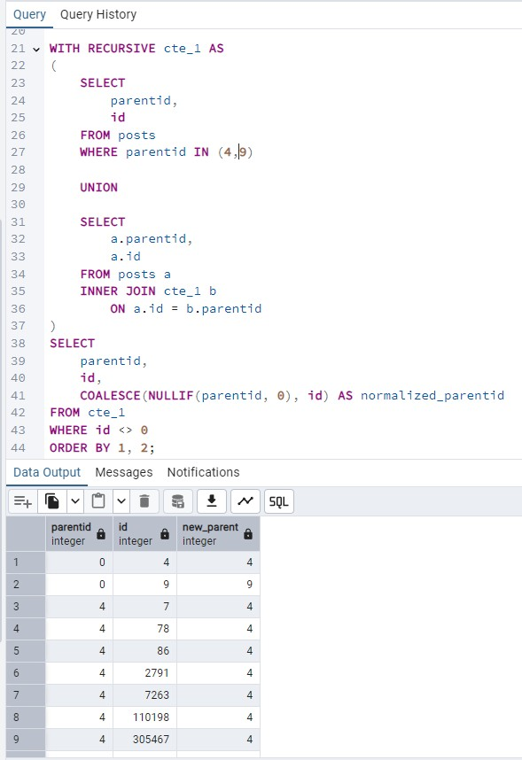
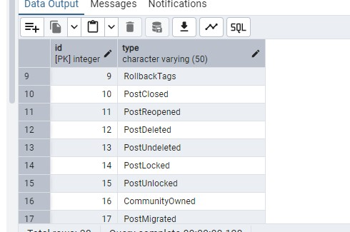
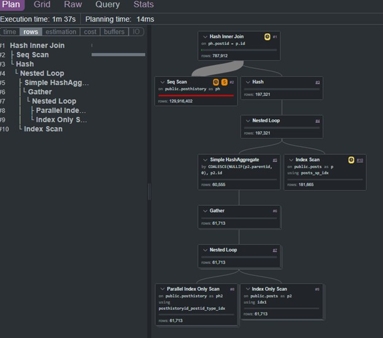
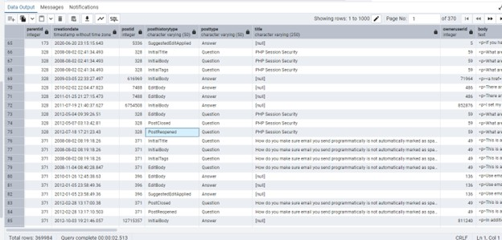

Suppose you want to identify all question posts that have been reopened and extract the key timeline milestones across the question and its related answers: the initial event, close event, reopen event, and the first entries (including ties) occurring at least 90 calendar days after the last recorded milestone.

We will also sometimes refer to a question post as a parent or parent post, since the other posts are its children.

In this dataset, posthistorytypeid values 1, 2, and 3 represent the initial post events or a question event, 10 represents a close event, and 11 represents a reopen event.

This is not a simple filtering problem. The solution must process each post’s history in sequence and carry forward the most recently recorded milestone date so later rows can be tested against it. That is why a recursive CTE is used.

The final solution looks like this, and the following sections explain how it was built step by step.
````sql
 WITH RECURSIVE reopened_posts_grp_cte AS (
            SELECT
                parentid,
                creationdate,
                creationdate AS recordeddate,
                postid,
                posthistorytypeid,
                posttypeid,
                CASE
                    WHEN posthistorytypeid IN (1, 2, 3)
                         AND posttypeid = 1
                    THEN 1
                    ELSE 0
                END AS show_flag,
                title,
                owneruserid,
                body,
                tags,
                grp
            FROM reopened_posts_grp
            WHERE grp = 1

            UNION ALL

            SELECT DISTINCT
                a.parentid,
                a.creationdate,
                CASE
                    WHEN (
                        a.posthistorytypeid IN (1, 2, 3, 10, 11)
                        AND a.posttypeid = 1
                    )
                    OR (
                        date_trunc('day', a.creationdate + interval '12 hours')
                        - date_trunc('day', b.recordeddate + interval '12 hours')
                        >= '90 days'::interval
                    )
                    THEN a.creationdate
                    ELSE b.recordeddate
                END,
                a.postid,
                a.posthistorytypeid,
                a.posttypeid,
                CASE
                    WHEN (
                        a.posthistorytypeid IN (1, 2, 3, 10, 11)
                        AND a.posttypeid = 1
                    )
                    OR (
                        date_trunc('day', a.creationdate + interval '12 hours')
                        - date_trunc('day', b.recordeddate + interval '12 hours')
                        >= '90 days'::interval
                    )
                    THEN 1
                    ELSE 0
                END AS show_flag,
                a.title,
                a.owneruserid,
                a.body,
                a.tags,
                a.grp
            FROM reopened_posts_grp_cte b
            INNER JOIN reopened_posts_grp a
                ON a.parentid = b.parentid
               AND a.grp = b.grp + 1
        )
        SELECT
            a.parentid,
            a.creationdate,
            a.postid,
            a.title,
            a.owneruserid,
            a.body,
            a.tags,
            a.posthistorytypeid,
            a.posttypeid,
            b.type AS posthistorytype,
            c.type AS posttype
        FROM reopened_posts_grp_cte a
        INNER JOIN posthistorytypes b
            ON a.posthistorytypeid = b.id
        INNER JOIN posttypes c
            ON a.posttypeid = c.id
        WHERE show_flag = 1
        ORDER BY parentid, grp, posttypeid, posthistorytypeid;
````

The early steps are mostly data reduction. The base tables, posts and posthistory, are large enough that trying to solve the entire problem directly against them is a bad idea, especially when ordered processing and window logic are involved. That approach risks large sort spills and unnecessary work.

Instead, the data is narrowed down in stages until only the relevant reopened-question history remains. By the time the recursive CTE is applied, it is no longer operating on the full event universe, but on a much smaller pre-final table built specifically for this analysis.

Step 1 — Normalize Parent Grouping in posts

The first issue was structural. In the posts table, root posts store parentid = 0, while child posts store the actual parent post id in parentid. This means the raw parentid column cannot be used directly as a grouping key, because the parent post itself is excluded from its own family grouping.
- 

For example, if post 4 is the root question, its row appears as:

parentid = 0, id = 4

But its related child posts appear as:

parentid = 4, id = ...

If grouped directly by parentid, the children group under 4, while the parent remains under 0, splitting what should be one logical post family.

To correct this, I derived a normalized grouping key:

coalesce(nullif(parentid, 0), id) as root_parentid

This converts each root post into its own grouping key and assigns all child posts to that same value. As a result, both the parent and its descendants can be processed under one unified parent scope.

Step 2 — Reduce the Working Set to Reopened Post Families

After normalizing parent grouping in posts, the next step was to aggressively reduce the working set.

The key observation was that posthistory.posthistorytypeid = 11 represents a reopened event. Since this entry is specifically concerned with reconstructing reopened post activity, that event type becomes the first major filter.
- 

Instead of processing all post-history activity uniformly, I first restricted the workflow to only those post families whose normalized parent group contains at least one reopened event. This sharply reduces the amount of data carried into later recursive steps.

To support that reduction, I created two indexes:
```sql
CREATE INDEX IF NOT EXISTS posthistory_type_postid_idx
    ON posthistory (posthistorytypeid, postid);

CREATE INDEX IF NOT EXISTS posts_normalized_parent_idx
    ON posts ((COALESCE(NULLIF(parentid, 0), id)));

ANALYZE posthistory;
ANALYZE posts;

DROP TABLE IF EXISTS reopened_posts;

CREATE TEMP TABLE reopened_posts AS
SELECT
    COALESCE(NULLIF(p.parentid, 0), p.id) AS parentid,
    ph.creationdate,
    ph.posthistorytypeid,
    ph.postid,
    p.posttypeid,
    p.title,
    p.body,
    p.owneruserid,
    p.tags
FROM posthistory ph
INNER JOIN posts p
    ON ph.postid = p.id
WHERE EXISTS
(
    SELECT 1
    FROM posthistory ph2
    INNER JOIN posts p2
        ON ph2.postid = p2.id
    WHERE ph2.posthistorytypeid = 11
      AND COALESCE(NULLIF(p.parentid, 0), p.id)
          = COALESCE(NULLIF(p2.parentid, 0), p2.id)
);

ANALYZE reopened_posts;
```
- 

This query does not sort the result set, which keeps the reduction step cheaper. The main cost is the broad scan of posthistory, while indexed lookups are used where the planner can apply them effectively.

In practical terms, this first reduction step cuts the working set down from roughly 130 million rows in posthistory to about 800 thousand rows in the reduced temporary table, with execution completing in approximately 1 minute 37 seconds.

That matters because the recursive logic no longer starts from the full history table. It starts from a materially smaller subset containing only post families that are actually relevant to reopened activity.

Step 3. We reduce the dataset further by keeping only parent groups that contain a known starting point. A valid starting point is represented by posthistorytypeid IN (1,2,3), which marks the initial creation-related records. This prevents us from analyzing a history chain that begins from an unknown intermediate state.

At this stage, we use dense_rank() instead of row_number(). The goal is to preserve timestamp ties within the same parentid, so that all records created at the same moment remain in the same group. This is important because those tied records represent the same logical event window and should be evaluated together in the recursive step that follows.
```sql
SELECT
    a.*,
    DENSE_RANK() OVER (
        PARTITION BY a.parentid
        ORDER BY a.creationdate
    ) AS grp
FROM reopened_posts a
WHERE EXISTS (
    SELECT 1
    FROM reopened_posts b
    WHERE b.parentid = a.parentid
      AND b.posthistorytypeid IN (1, 2, 3)
);
```
Step 4. We create a recursive CTE that walks through each parentid group one timestamp bucket at a time by using the dense_rank() value generated in the previous step.

This step introduces two control columns.

show_flag determines whether a record should appear in the final output.

recordeddate acts as a buffered comparison date. It is updated only when a row satisfies the reset condition, and it is then used to decide whether the next timestamp group is far enough away to be shown.

Unlike the earlier row_number() approach, this version preserves tied timestamps by grouping them under the same grp value. That makes the output more faithful to the source history, since rows created at the same moment are treated as belonging to the same event window.

A row is marked for output when either of these conditions is met:

it is a question-level reset record with posthistorytypeid IN (1,2,3,10,11), or
its rounded day is at least 90 days after the rounded day of the current recordeddate.

To make the 90-day rule easier for a user to inspect manually, both dates are normalized to the nearest day by adding 12 hours and then truncating to midnight. This avoids the one-sided bias that would come from simply truncating timestamps to date.

Because dense_rank() can create duplicate recursive paths when multiple rows share the same timestamp group, the recursive branch uses DISTINCT to remove repeated states and prevent recursive fan-out.
```sql
 WITH RECURSIVE reopened_posts_grp_cte AS (
            SELECT
                parentid,
                creationdate,
                creationdate AS recordeddate,
                postid,
                posthistorytypeid,
                posttypeid,
                CASE
                    WHEN posthistorytypeid IN (1, 2, 3)
                         AND posttypeid = 1
                    THEN 1
                    ELSE 0
                END AS show_flag,
                title,
                owneruserid,
                body,
                tags,
                grp
            FROM reopened_posts_grp
            WHERE grp = 1

            UNION ALL

            SELECT DISTINCT
                a.parentid,
                a.creationdate,
                CASE
                    WHEN (
                        a.posthistorytypeid IN (1, 2, 3, 10, 11)
                        AND a.posttypeid = 1
                    )
                    OR (
                        date_trunc('day', a.creationdate + interval '12 hours')
                        - date_trunc('day', b.recordeddate + interval '12 hours')
                        >= '90 days'::interval
                    )
                    THEN a.creationdate
                    ELSE b.recordeddate
                END,
                a.postid,
                a.posthistorytypeid,
                a.posttypeid,
                CASE
                    WHEN (
                        a.posthistorytypeid IN (1, 2, 3, 10, 11)
                        AND a.posttypeid = 1
                    )
                    OR (
                        date_trunc('day', a.creationdate + interval '12 hours')
                        - date_trunc('day', b.recordeddate + interval '12 hours')
                        >= '90 days'::interval
                    )
                    THEN 1
                    ELSE 0
                END AS show_flag,
                a.title,
                a.owneruserid,
                a.body,
                a.tags,
                a.grp
            FROM reopened_posts_grp_cte b
            INNER JOIN reopened_posts_grp a
                ON a.parentid = b.parentid
               AND a.grp = b.grp + 1
        )
        SELECT
            a.parentid,
            a.creationdate,
            a.postid,
            a.title,
            a.owneruserid,
            a.body,
            a.tags,
            a.posthistorytypeid,
            a.posttypeid,
            b.type AS posthistorytype,
            c.type AS posttype
        FROM reopened_posts_grp_cte a
        INNER JOIN posthistorytypes b
            ON a.posthistorytypeid = b.id
        INNER JOIN posttypes c
            ON a.posttypeid = c.id
        WHERE show_flag = 1
        ORDER BY parentid, grp, posttypeid, posthistorytypeid
```
- 

    You can also download a sample csv from here:

[Download CSV](https://raw.githubusercontent.com/stansegelman/my_work_portfolio_public/refs/heads/main/entry_06_reopened_posts_with_recursive_cte/files/reopened_final_results_20260409183043.csv)