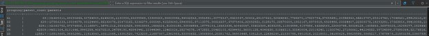
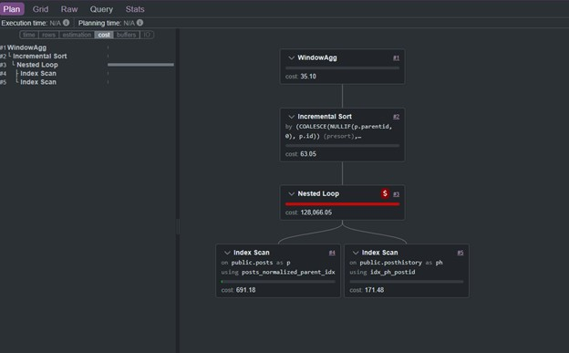
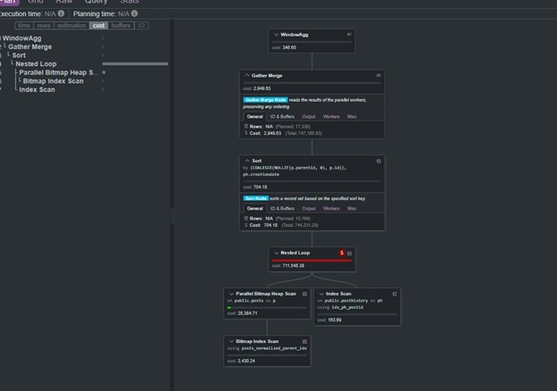
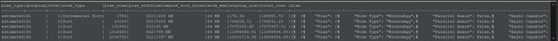

Introduction

This entry demonstrates a practical method for estimating when a PostgreSQL sort operation will exceed work_mem and fall back to a disk-based external merge sort. Since PostgreSQL does not indicate this behavior in estimated execution plans, the approach relies on analyzing planner outputs and observing how sort characteristics change as input size grows.

To make the analysis meaningful, this example reuses a real query pattern and introduces controlled batching. A set of unique parent entities is first generated, and then the query is executed repeatedly while increasing the batch size. At each step, the estimated execution plan is inspected to track changes in row counts, row width, and sort nodes (both plain Sort and Incremental Sort).

The goal is to identify the point at which the estimated memory requirements for sorting exceed work_mem, indicating a high likelihood of a spill to disk. These predictions are then validated using EXPLAIN ANALYZE, comparing estimated behavior with actual runtime results.

This method shows how execution plans can be used not just for debugging, but for proactively identifying scalability limits and preventing performance issues before running expensive queries.

I used this website to generate graphics for some of the execution plans: 

[remote website](https://explain.dalibo.com/)


# Step 1 creates a distinct list of normalized parent post IDs. 

Questions keep their own ID as the parent key, while answers inherit the question ID through parentid. This produces one row per question-level post family and gives the batching process a clean control table.
```sql
SET work_mem = '64MB';
SET max_parallel_workers_per_gather = 1;

DROP TABLE IF EXISTS unique_parents;

CREATE TABLE unique_parents AS
SELECT DISTINCT
    COALESCE(NULLIF(parentid, 0), id) AS parentid
FROM posts;

ANALYZE unique_parents;
```
# Step 2 – Create Controlled Batch Groupings

This step creates multiple batch groupings of parent post IDs at different sizes. Each parent is assigned to several modulo-based buckets, allowing the same dataset to be queried at progressively larger scales.
```sql
DROP TABLE IF EXISTS parent_groupings;

CREATE TEMP TABLE parent_groupings AS
WITH agg_1 AS
(
    SELECT
        parentid,
        ((ROW_NUMBER() OVER (ORDER BY parentid) - 1) % 300000) + 1 AS rwn1,
        ((ROW_NUMBER() OVER (ORDER BY parentid) - 1) % 30000)  + 1 AS rwn2,
        ((ROW_NUMBER() OVER (ORDER BY parentid) - 1) % 3000)   + 1 AS rwn3,
        ((ROW_NUMBER() OVER (ORDER BY parentid) - 1) % 300)    + 1 AS rwn4,
        ((ROW_NUMBER() OVER (ORDER BY parentid) - 1) % 150)    + 1 AS rwn5
    FROM unique_parents
)
SELECT
    COUNT(parentid) AS parent_count,
    ARRAY_AGG(parentid) AS parentids,
    GROUPING(rwn1) AS g1,
    GROUPING(rwn2) AS g2,
    GROUPING(rwn3) AS g3,
    GROUPING(rwn4) AS g4,
    GROUPING(rwn5) AS g5
FROM agg_1
GROUP BY GROUPING SETS
(
    (rwn1),
    (rwn2),
    (rwn3),
    (rwn4),
    (rwn5)
);
```
Explanation

This step prepares the dataset for controlled scalability testing.

Each parent ID is assigned to multiple grouping buckets using modulo operations on a row number. Different divisors (300000 down to 150) produce batches of increasing size:

Larger divisor → smaller batch
Smaller divisor → larger batch

The result is a set of parent ID arrays, each representing a different batch size. These arrays are later used to execute the same query against progressively larger inputs.

The use of GROUPING SETS allows all batch sizes to be generated in a single pass, avoiding multiple scans of the source data.

# Step 3 – Select One Representative Batch Per Grouping Level
```sql
DROP TABLE IF EXISTS parent_batches;

CREATE TEMP TABLE parent_batches
(
    grouping     varchar(2),
    parent_count int,
    parents      int[]
);

INSERT INTO parent_batches
SELECT DISTINCT ON (grouping)
    grouping,
    parent_count,
    parentids AS parents
FROM
(
    SELECT
        CASE
            WHEN (g1, g2, g3, g4, g5) = (0, 1, 1, 1, 1) THEN 'G1'
            WHEN (g1, g2, g3, g4, g5) = (1, 0, 1, 1, 1) THEN 'G2'
            WHEN (g1, g2, g3, g4, g5) = (1, 1, 0, 1, 1) THEN 'G3'
            WHEN (g1, g2, g3, g4, g5) = (1, 1, 1, 0, 1) THEN 'G4'
            WHEN (g1, g2, g3, g4, g5) = (1, 1, 1, 1, 0) THEN 'G5'
        END AS grouping,
        parent_count,
        parentids
    FROM parent_groupings
    WHERE
        (g1, g2, g3, g4, g5) IN
        (
            (0, 1, 1, 1, 1),
            (1, 0, 1, 1, 1),
            (1, 1, 0, 1, 1),
            (1, 1, 1, 0, 1),
            (1, 1, 1, 1, 0)
        )
) x
ORDER BY
    grouping,
    parent_count DESC;
```


This step reduces the full parent_groupings table into one representative batch for each batch level.

- 

The previous step produces many batches for each grouping level. For this experiment, only one batch from each level is needed. The query uses DISTINCT ON (grouping) to keep one row per grouping category: G1, G2, G3, G4, and G5.

The ORDER BY grouping, parent_count DESC clause makes the selection deterministic and chooses the largest available batch for each grouping level.

The resulting parent_batches table becomes the driver table for the execution-plan tests. Each row contains:

grouping      batch label
parent_count  number of parent IDs in the batch
parents       array of parent IDs used as query input

This creates a controlled set of progressively larger inputs while keeping the tested query logic unchanged.

# Step 4 – Capture Estimated Plans and Extract Sort Nodes

This step captures estimated execution plans for the test query across each parent batch size.

The test query is based on the query from entry 6 where we want to rank parent posts by creationdate to be prepared for our recursive subquery.

The tested query intentionally uses DENSE_RANK():
```sql
DENSE_RANK() OVER (
    PARTITION BY COALESCE(NULLIF(p.parentid, 0), p.id)
    ORDER BY ph.creationdate
) AS rwn
```
This window function requires PostgreSQL to order rows by parent post and creation date. Depending on the available ordering and the planner’s choices, this may produce either a plain Sort node or an Incremental Sort node.

The estimated plans are stored as JSON so they can be inspected programmatically.
```sql
DROP TABLE IF EXISTS temp.exec_plans;

CREATE TABLE temp.exec_plans
(
    grouping     text,
    plan_type    varchar(20),
    plan         json,
    creationdate timestamp DEFAULT clock_timestamp()
);
```
For each batch in parent_batches, the query captures the estimated plan:
```sql
DO $$
DECLARE
    v_plan json;
    rec record;
BEGIN
    FOR rec IN
        SELECT grouping, parents
        FROM parent_batches
    LOOP
        FOR v_plan IN
            EXPLAIN (VERBOSE, FORMAT JSON, BUFFERS, COSTS)
            SELECT
                COALESCE(NULLIF(p.parentid, 0), p.id) AS parentid,
                ph.creationdate,
                ph.posthistorytypeid,
                p.posttypeid,
                p.title,
                p.body,
                DENSE_RANK() OVER (
                    PARTITION BY COALESCE(NULLIF(p.parentid, 0), p.id)
                    ORDER BY ph.creationdate
                ) AS rwn
            FROM posthistory ph
            INNER JOIN posts p
                ON ph.postid = p.id
            WHERE COALESCE(NULLIF(p.parentid, 0), p.id) = ANY(rec.parents)
        LOOP
            INSERT INTO temp.exec_plans
            (
                grouping,
                plan_type,
                plan
            )
            VALUES
            (
                rec.grouping,
                'estimated',
                v_plan
            );

            RAISE NOTICE '%', rec.grouping;
        END LOOP;
    END LOOP;
END;
$$;
```
The the explain statments generates two types of plans one for a small batch which has incremental sort and one for larger batches that has regular sort.

- 

- 


The saved JSON plans are then recursively searched for Sort and Incremental Sort nodes:
```sql
WITH RECURSIVE plan_cte AS
(
    SELECT
        plan_root->'Plan' AS node,
        0 AS level,
        grouping,
        plan_type,
        plan
    FROM temp.exec_plans,
         jsonb_array_elements(plan::jsonb) AS plan_root
    WHERE plan_type = 'estimated'

    UNION ALL

    SELECT
        child_node AS node,
        plan_cte.level + 1 AS level,
        plan_cte.grouping,
        plan_cte.plan_type,
        plan_cte.plan
    FROM plan_cte,
         jsonb_array_elements(COALESCE(plan_cte.node->'Plans', '[]'::jsonb)) AS child_node
)
SELECT
    plan_type,
    grouping,
    level,
    node->>'Node Type' AS node_type,
    (node->>'Plan Rows')::bigint AS plan_rows,
    (node->>'Plan Width')::bigint AS plan_width,
    pg_size_pretty(
        ((node->>'Plan Rows')::bigint * (node->>'Plan Width')::bigint)
    ) AS estimated_sort_bytes,
    '64 MB' AS work_mem,
    node->>'Startup Cost' AS startup_cost,
    node->>'Total Cost' AS total_cost,
    plan
FROM plan_cte
WHERE node->>'Node Type' IN ('Sort', 'Incremental Sort')
ORDER BY
    grouping,
    level;
```    
Explanation

This step extracts only the sort-related nodes from each estimated plan.

For each detected Sort or Incremental Sort, the query captures:

Plan Rows
Plan Width
Node Type
Startup Cost
Total Cost

The estimated memory pressure is approximated as:

Plan Rows × Plan Width

This value is compared against the configured work_mem of 64 MB.

Because this is an estimated plan, PostgreSQL does not yet report whether the sort will actually use memory or disk. The purpose of this step is to predict spill risk before the query is executed.

- 

The estimated output shows one clear transition point. G1 and G2 remain below the practical spill threshold, G3 becomes the borderline case, and G4/G5 are large enough that disk-based external merge sort is expected.


# Step 5 – Execute Query and Capture Actual Sort Behavior

This step runs the same query using EXPLAIN ANALYZE to capture the actual execution plan. Unlike the estimated plan, this includes the real sort method used by PostgreSQL.
```sql
DO $$
DECLARE 
    v_plan json;
    rec record;
BEGIN
    FOR rec IN 
        SELECT grouping, parents 
        FROM parent_batches
    LOOP
        FOR v_plan IN
            EXPLAIN (VERBOSE, FORMAT JSON, BUFFERS, COSTS, ANALYZE, TIMING, WAL)
            /*Sample Query*/
            SELECT
                COALESCE(NULLIF(p.parentid, 0), p.id) AS parentid,
                ph.creationdate,
                ph.posthistorytypeid,
                p.posttypeid,
                p.title,
                p.body,
                DENSE_RANK() OVER (
                    PARTITION BY COALESCE(NULLIF(p.parentid, 0), p.id)
                    ORDER BY ph.creationdate
                ) AS rwn
            FROM posthistory ph
            INNER JOIN posts p
                ON ph.postid = p.id
            WHERE COALESCE(NULLIF(p.parentid, 0), p.id) = ANY(rec.parents)
            /* Sample End */
        LOOP
            INSERT INTO temp.exec_plans(grouping, plan_type, plan)
            VALUES (rec.grouping, 'actual', v_plan);

            RAISE NOTICE '%', rec.grouping;
        END LOOP;
    END LOOP;
END;
$$;
```
The resulting JSON plans are then recursively parsed to extract only Sort and Incremental Sort nodes:
```sql
WITH RECURSIVE plan_cte AS
(
    SELECT
        plan_root->'Plan' AS node,
        0 AS level,
        grouping,
        plan_type,
        plan
    FROM temp.exec_plans,
         jsonb_array_elements(plan::jsonb) AS plan_root
    WHERE plan_type = 'actual'

    UNION ALL

    SELECT
        child_node AS node,
        plan_cte.level + 1 AS level,
        plan_cte.grouping,
        plan_cte.plan_type,
        plan_cte.plan
    FROM plan_cte,
         jsonb_array_elements(
             COALESCE(plan_cte.node->'Plans', '[]'::jsonb)
         ) AS child_node
)
SELECT
    plan_type,
    grouping,
    level,
    node->>'Node Type' AS node_type,
    (node->>'Plan Rows')::bigint AS plan_rows,
    (node->>'Plan Width')::bigint AS plan_width,
    pg_size_pretty(
        (node->>'Plan Rows')::bigint *
        (node->>'Plan Width')::bigint
    ) AS est_tot_workmem,
    '64 MB' AS work_mem,
    node->>'Sort Method' AS sort_method,
    node->>'Sort Space Type' AS sort_space_type,
    node->>'Startup Cost' AS startup_cost,
    node->>'Total Cost' AS total_cost
FROM plan_cte
WHERE node->>'Node Type' IN ('Sort', 'Incremental Sort')
ORDER BY level;
```
- 

Result Interpretation
G1 → Incremental Sort (in memory)
G2 → Sort (quicksort, memory)
G3 → Sort (quicksort, memory)
G4 → Sort (external merge, disk)
G5 → Sort (external merge, disk)
Conclusion
The estimated-plan analysis correctly identified the transition boundary. G3 acted as the borderline case, while G4 and G5 exceeded work_mem by a large margin and consistently produced disk-based external merge sorts.

This confirms that estimated execution plans can be used to identify sort spill risk before execution.

## Execution Environment and System Metrics

* OS: Windows 11 Pro (Build 26100)
* CPU: Intel Core i7 (13th Gen, 12 cores / 16 threads)
* RAM: 32 GB DDR4 @ 4800 MT/s
* Disk: Samsung NVMe SSD (954 GB)
* PostgreSQL 14.18 on x86_64-pc-linux-gnu, compiled by gcc (Ubuntu 13.3.0-6ubuntu2~24.04) 13.3.0, 64-bit
* Total DB Size: 205 GB
* CPU Load: ~23% peak during execution
* RAM Usage: ~13 GB steady
* Disk I/O: Minimal due to efficient indexing and memory planning

