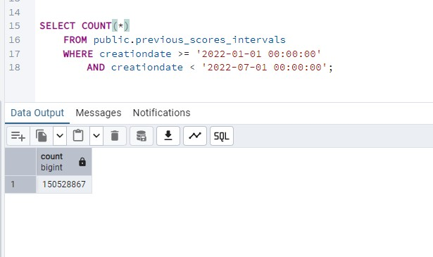
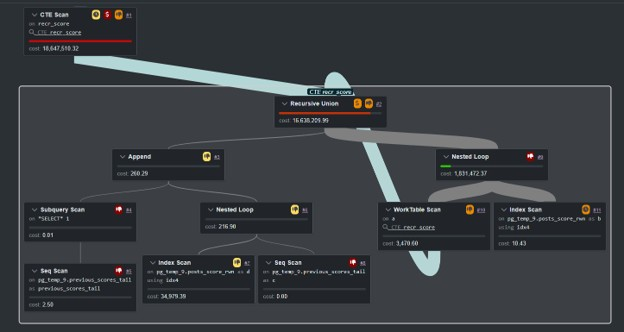

# Entry 08 - Time-Series User Scoring System

## Overview

One of the challenges in community-driven platforms is measuring user engagement over time rather than evaluating isolated events. A user may be highly active for several months, become inactive for an extended period, and later return to regular participation. Traditional reporting often captures activity counts but does not provide a mechanism for measuring long-term engagement trends.

This project implements a Time-Series User Scoring System using the Stack Overflow public dataset. User activities such as asking questions, posting answers, receiving accepted answers, writing comments, and casting votes are converted into a unified chronological event stream. Each event contributes a weighted score that is accumulated over time to produce a historical participation score.

To discourage score inflation from dormant accounts, the system also introduces inactivity penalties. Every thirty consecutive days without activity results in a score reduction, creating a dynamic balance between contribution and inactivity. The result is a continuously evolving score that reflects both historical participation and recent engagement.

The implementation processes millions of records using PostgreSQL recursive queries, window functions, and incremental score persistence. Rather than recalculating the entire history during each execution, previously calculated scores are used as seed records, allowing the system to continue processing from the last known state.

The final output produces a complete historical timeline showing how a user's score changes over time as new activity occurs and inactivity penalties are applied.

Each user activity is converted into a scoring event and assigned a predefined weight. Positive contributions increase the score, while prolonged inactivity results in periodic penalties. The following table defines the scoring model used by the system.

| Event | Points |
|--------|--------:|
| 🟩 Question Asked | +3 |
| 🟩 Answer Posted But Not Accepted | +5 |
| 🟩 Accepted Answer | +10 |
| 🟩 Comment Posted | +2 |
| 🟩 Vote Cast | +1 |
| 🟥 30 Consecutive Idle Days | -5 |


The sample below demONstrates how the scoring system evolves over time. The row marked with 🔴 red indicators represents a previously calculated seed record loaded from persistent storage. This record is used to resume score calculations from the lASt known state and is excluded from the final output. It is displayed here only to illustrate how incremental processing cONtinues from previously calculated data. The 🟢 green indicators highlight the `tot` column, which contains the user's cumulative score after all activity and inactivity adjustments have been applied.

### Column DefinitiONs

| Column           | DescriptiON                                                                                      |
| ---------------- | ------------------------------------------------------------------------------------------------ |
| `user_id`        | Stack Overflow user identifier.                                                                  |
| `creationdate`   | Date and time the event occurred.                                                                |
| `postid`         | Associated post identifier when applicable.                                                      |
| `action`         | Activity type such as asked, commented, voted, accepted answer, or idle.                         |
| `score`          | Points assigned to the current event based on the scoring rules.                                 |
| `tot`            | Running cumulative score after applying all previous events and inactivity penalties.            |
| `idle_score`     | Daily inactivity indicator used to track idle periods.                                           |
| `tot_idle_score` | Running inactivity counter used to determine when a 30-day penalty should be applied.            |
| `rwn`            | Sequential event number generated using `ROW_NUMBER()` to ensure deterministic processing order. |

Immediately following the seed record, the user reaches thirty consecutive idle days, causing the score to decrease from **745** to **740** and the inactivity counter to reset. On **January 25, 2022**, the user becomes active again by asking a question and posting multiple comments, increasing the score to **761**. Additional comments, votes, and answers continue to raise the score through February and early march, reaching **774** on **February 28, 2022**.

The user then enters another extended inactive period. As the inactivity counter progresses from `-1` to `-29`, a second inactivity penalty is triggered on **March 30, 2022**, reducing the cumulative score from **774** to **769** and resetting the inactivity counter back to zero. Subsequent activity in May once again increases the score, eventually reaching **785**, demonstrating how the system rewards continued participation while gradually reducing the score of dormant accounts through periodic inactivity penalties.


"user_id"|"creationdate"|"postid"|"action"|"score"|🟢"tot"|"idle_score"|"tot_idle_score"|"rwn"
--------|--------:|--------:|--------:|--------:|--------:|--------:|--------:|--------:
🔴8014824|🔴2021-12-31 00:00:00.000|🔴|🔴idle|🔴0|🔴745|🔴-1|🔴-29|🔴0
8014824|2022-01-01 00:00:00.000||idle|0|🟢740|-1|0|1
8014824|2022-01-02 00:00:00.000||idle|0|🟢740|-1|-1|2
8014824|2022-01-03 00:00:00.000||idle|0|🟢740|-1|-2|3
8014824|2022-01-04 00:00:00.000||idle|0|🟢740|-1|-3|4
8014824|2022-01-05 00:00:00.000||idle|0|🟢740|-1|-4|5
8014824|2022-01-06 00:00:00.000||idle|0|🟢740|-1|-5|6
8014824|2022-01-07 00:00:00.000||idle|0|🟢740|-1|-6|7
8014824|2022-01-08 00:00:00.000||idle|0|🟢740|-1|-7|8
8014824|2022-01-09 00:00:00.000||idle|0|🟢740|-1|-8|9
8014824|2022-01-10 00:00:00.000||idle|0|🟢740|-1|-9|10
8014824|2022-01-11 00:00:00.000||idle|0|🟢740|-1|-10|11
8014824|2022-01-12 00:00:00.000||idle|0|🟢740|-1|-11|12
8014824|2022-01-13 00:00:00.000||idle|0|🟢740|-1|-12|13
8014824|2022-01-14 00:00:00.000||idle|0|🟢740|-1|-13|14
8014824|2022-01-15 00:00:00.000||idle|0|🟢740|-1|-14|15
8014824|2022-01-16 00:00:00.000||idle|0|🟢740|-1|-15|16
8014824|2022-01-17 00:00:00.000||idle|0|🟢740|-1|-16|17
8014824|2022-01-18 00:00:00.000||idle|0|🟢740|-1|-17|18
8014824|2022-01-19 00:00:00.000||idle|0|🟢740|-1|-18|19
8014824|2022-01-20 00:00:00.000||idle|0|🟢740|-1|-19|20
8014824|2022-01-21 00:00:00.000||idle|0|🟢740|-1|-20|21
8014824|2022-01-22 00:00:00.000||idle|0|🟢740|-1|-21|22
8014824|2022-01-23 00:00:00.000||idle|0|🟢740|-1|-22|23
8014824|2022-01-24 00:00:00.000||idle|0|🟢740|-1|-23|24
8014824|2022-01-25 20:39:27.530|70855373|asked|3|🟢743|0|0|25
8014824|2022-01-25 21:05:09.870|70709385|commented|2|🟢745|0|0|26
8014824|2022-01-25 21:09:28.080|70764701|commented|2|🟢747|0|0|27
8014824|2022-01-25 21:14:02.083|66700604|commented|2|🟢749|0|0|28
8014824|2022-01-25 21:14:41.870|70772906|commented|2|🟢751|0|0|29
8014824|2022-01-25 21:19:42.260|57894281|commented|2|🟢753|0|0|30
8014824|2022-01-25 21:22:02.827|70777859|commented|2|🟢755|0|0|31
8014824|2022-01-25 21:25:06.313|70806391|commented|2|🟢757|0|0|32
8014824|2022-01-25 21:26:11.807|70816587|commented|2|🟢759|0|0|33
8014824|2022-01-25 21:44:38.397|70836226|commented|2|🟢761|0|0|34
8014824|2022-01-26 00:00:00.000||idle|0|🟢761|-1|-1|35
8014824|2022-01-27 00:00:00.000||idle|0|🟢761|-1|-2|36
8014824|2022-01-28 00:00:00.000||idle|0|🟢761|-1|-3|37
8014824|2022-01-29 00:00:00.000||idle|0|🟢761|-1|-4|38
8014824|2022-01-30 00:00:00.000||idle|0|🟢761|-1|-5|39
8014824|2022-01-31 00:00:00.000||idle|0|🟢761|-1|-6|40
8014824|2022-02-01 00:00:00.000||idle|0|🟢761|-1|-7|41
8014824|2022-02-02 00:00:00.000||idle|0|🟢761|-1|-8|42
8014824|2022-02-03 00:00:00.000||idle|0|🟢761|-1|-9|43
8014824|2022-02-04 00:00:00.000||idle|0|🟢761|-1|-10|44
8014824|2022-02-05 00:00:00.000||idle|0|🟢761|-1|-11|45
8014824|2022-02-06 00:00:00.000||idle|0|🟢761|-1|-12|46
8014824|2022-02-07 22:10:32.213|69320242|commented|2|🟢763|0|0|47
8014824|2022-02-08 00:00:00.000||idle|0|🟢763|-1|-1|48
8014824|2022-02-09 00:00:00.000|60652908|voted|1|🟢764|0|0|49
8014824|2022-02-10 00:00:00.000||idle|0|🟢764|-1|-1|50
8014824|2022-02-11 00:00:00.000||idle|0|🟢764|-1|-2|51
8014824|2022-02-12 00:00:00.000||idle|0|🟢764|-1|-3|52
8014824|2022-02-13 00:00:00.000||idle|0|🟢764|-1|-4|53
8014824|2022-02-14 00:00:00.000||idle|0|🟢764|-1|-5|54
8014824|2022-02-15 00:00:00.000||idle|0|🟢764|-1|-6|55
8014824|2022-02-16 00:00:00.000||idle|0|🟢764|-1|-7|56
8014824|2022-02-17 16:59:21.797|37229338|commented|2|🟢766|0|0|57
8014824|2022-02-17 17:11:59.353|37229338|commented|2|🟢768|0|0|58
8014824|2022-02-18 00:00:00.000||idle|0|🟢768|-1|-1|59
8014824|2022-02-19 00:00:00.000||idle|0|🟢768|-1|-2|60
8014824|2022-02-20 00:00:00.000||idle|0|🟢768|-1|-3|61
8014824|2022-02-21 00:00:00.000||idle|0|🟢768|-1|-4|62
8014824|2022-02-22 00:00:00.000||idle|0|🟢768|-1|-5|63
8014824|2022-02-23 20:21:25.870|71243583|not accepted answer|5|🟢773|0|0|64
8014824|2022-02-24 00:00:00.000||idle|0|🟢773|-1|-1|65
8014824|2022-02-25 00:00:00.000||idle|0|🟢773|-1|-2|66
8014824|2022-02-26 00:00:00.000||idle|0|🟢773|-1|-3|67
8014824|2022-02-27 00:00:00.000||idle|0|🟢773|-1|-4|68
8014824|2022-02-28 00:00:00.000|61316005|voted|1|🟢774|0|0|69
8014824|2022-03-01 00:00:00.000||idle|0|🟢774|-1|-1|70
8014824|2022-03-02 00:00:00.000||idle|0|🟢774|-1|-2|71
8014824|2022-03-03 00:00:00.000||idle|0|🟢774|-1|-3|72
8014824|2022-03-04 00:00:00.000||idle|0|🟢774|-1|-4|73
8014824|2022-03-05 00:00:00.000||idle|0|🟢774|-1|-5|74
8014824|2022-03-06 00:00:00.000||idle|0|🟢774|-1|-6|75
8014824|2022-03-07 00:00:00.000||idle|0|🟢774|-1|-7|76
8014824|2022-03-08 00:00:00.000||idle|0|🟢774|-1|-8|77
8014824|2022-03-09 00:00:00.000||idle|0|🟢774|-1|-9|78
8014824|2022-03-10 00:00:00.000||idle|0|🟢774|-1|-10|79
8014824|2022-03-11 00:00:00.000||idle|0|🟢774|-1|-11|80
8014824|2022-03-12 00:00:00.000||idle|0|🟢774|-1|-12|81
8014824|2022-03-13 00:00:00.000||idle|0|🟢774|-1|-13|82
8014824|2022-03-14 00:00:00.000||idle|0|🟢774|-1|-14|83
8014824|2022-03-15 00:00:00.000||idle|0|🟢774|-1|-15|84
8014824|2022-03-16 00:00:00.000||idle|0|🟢774|-1|-16|85
8014824|2022-03-17 00:00:00.000||idle|0|🟢774|-1|-17|86
8014824|2022-03-18 00:00:00.000||idle|0|🟢774|-1|-18|87
8014824|2022-03-19 00:00:00.000||idle|0|🟢774|-1|-19|88
8014824|2022-03-20 00:00:00.000||idle|0|🟢774|-1|-20|89
8014824|2022-03-21 00:00:00.000||idle|0|🟢774|-1|-21|90
8014824|2022-03-22 00:00:00.000||idle|0|🟢774|-1|-22|91
8014824|2022-03-23 00:00:00.000||idle|0|🟢774|-1|-23|92
8014824|2022-03-24 00:00:00.000||idle|0|🟢774|-1|-24|93
8014824|2022-03-25 00:00:00.000||idle|0|🟢774|-1|-25|94
8014824|2022-03-26 00:00:00.000||idle|0|🟢774|-1|-26|95
8014824|2022-03-27 00:00:00.000||idle|0|🟢774|-1|-27|96
8014824|2022-03-28 00:00:00.000||idle|0|🟢774|-1|-28|97
8014824|2022-03-29 00:00:00.000||idle|0|🟢774|-1|-29|98
8014824|2022-03-30 00:00:00.000||idle|0|🟢769|-1|0|99
8014824|2022-03-31 00:00:00.000||idle|0|🟢769|-1|-1|100
8014824|2022-04-01 00:00:00.000||idle|0|🟢769|-1|-2|101
8014824|2022-04-02 00:00:00.000||idle|0|🟢769|-1|-3|102
8014824|2022-04-03 00:00:00.000||idle|0|🟢769|-1|-4|103
8014824|2022-04-04 00:00:00.000||idle|0|🟢769|-1|-5|104
8014824|2022-04-05 00:00:00.000||idle|0|🟢769|-1|-6|105
8014824|2022-04-06 00:00:00.000||idle|0|🟢769|-1|-7|106
8014824|2022-04-07 00:00:00.000||idle|0|🟢769|-1|-8|107
8014824|2022-04-08 00:00:00.000||idle|0|🟢769|-1|-9|108
8014824|2022-04-09 00:00:00.000||idle|0|🟢769|-1|-10|109
8014824|2022-04-10 00:00:00.000||idle|0|🟢769|-1|-11|110
8014824|2022-04-11 00:00:00.000||idle|0|🟢769|-1|-12|111
8014824|2022-04-12 00:00:00.000||idle|0|🟢769|-1|-13|112
8014824|2022-04-13 00:00:00.000||idle|0|🟢769|-1|-14|113
8014824|2022-04-14 00:00:00.000||idle|0|🟢769|-1|-15|114
8014824|2022-04-15 00:00:00.000||idle|0|🟢769|-1|-16|115
8014824|2022-04-16 00:00:00.000||idle|0|🟢769|-1|-17|116
8014824|2022-04-17 00:00:00.000||idle|0|🟢769|-1|-18|117
8014824|2022-04-18 00:00:00.000||idle|0|🟢769|-1|-19|118
8014824|2022-04-19 00:00:00.000||idle|0|🟢769|-1|-20|119
8014824|2022-04-20 00:00:00.000||idle|0|🟢769|-1|-21|120
8014824|2022-04-21 00:00:00.000||idle|0|🟢769|-1|-22|121
8014824|2022-04-22 00:00:00.000||idle|0|🟢769|-1|-23|122
8014824|2022-04-23 00:00:00.000||idle|0|🟢769|-1|-24|123
8014824|2022-04-24 00:00:00.000||idle|0|🟢769|-1|-25|124
8014824|2022-04-25 00:00:00.000||idle|0|🟢769|-1|-26|125
8014824|2022-04-26 00:00:00.000||idle|0|🟢769|-1|-27|126
8014824|2022-04-27 00:00:00.000||idle|0|🟢769|-1|-28|127
8014824|2022-04-28 00:00:00.000||idle|0|🟢769|-1|-29|128
8014824|2022-04-29 00:00:00.000||idle|0|🟢764|-1|0|129
8014824|2022-04-30 00:00:00.000||idle|0|🟢764|-1|-1|130
8014824|2022-05-01 00:00:00.000||idle|0|🟢764|-1|-2|131
8014824|2022-05-02 00:00:00.000||idle|0|🟢764|-1|-3|132
8014824|2022-05-03 00:00:00.000||idle|0|🟢764|-1|-4|133
8014824|2022-05-04 14:52:41.273|72115079|asked|3|🟢767|0|0|134
8014824|2022-05-05 00:00:00.000||idle|0|🟢767|-1|-1|135
8014824|2022-05-06 00:00:00.000||idle|0|🟢767|-1|-2|136
8014824|2022-05-07 00:00:00.000||idle|0|🟢767|-1|-3|137
8014824|2022-05-08 00:00:00.000||idle|0|🟢767|-1|-4|138
8014824|2022-05-09 00:00:00.000||idle|0|🟢767|-1|-5|139
8014824|2022-05-10 00:00:00.000||idle|0|🟢767|-1|-6|140
8014824|2022-05-11 00:00:00.000||idle|0|🟢767|-1|-7|141
8014824|2022-05-12 00:00:00.000||idle|0|🟢767|-1|-8|142
8014824|2022-05-13 00:00:00.000||idle|0|🟢767|-1|-9|143
8014824|2022-05-14 00:00:00.000||idle|0|🟢767|-1|-10|144
8014824|2022-05-15 00:00:00.000||idle|0|🟢767|-1|-11|145
8014824|2022-05-16 00:00:00.000||idle|0|🟢767|-1|-12|146
8014824|2022-05-17 20:19:08.417|72280192|asked|3|🟢770|0|0|147
8014824|2022-05-17 20:19:08.417|72280193|not accepted answer|5|🟢775|0|0|148
8014824|2022-05-18 00:00:00.000|72115079|voted|1|🟢776|0|0|149
8014824|2022-05-18 07:58:09.127|72285262|not accepted answer|5|🟢781|0|0|150
8014824|2022-05-18 13:05:42.420|72115079|commented|2|🟢783|0|0|151
8014824|2022-05-18 14:47:40.190|72115079|commented|2|🟢785|0|0|152
8014824|2022-05-19 00:00:00.000||idle|0|🟢785|-1|-1|153
8014824|2022-05-20 00:00:00.000||idle|0|🟢785|-1|-2|154
8014824|2022-05-21 00:00:00.000||idle|0|🟢785|-1|-3|155
8014824|2022-05-22 00:00:00.000||idle|0|🟢785|-1|-4|156
8014824|2022-05-23 00:00:00.000||idle|0|🟢785|-1|-5|157
8014824|2022-05-24 00:00:00.000||idle|0|🟢785|-1|-6|158
8014824|2022-05-25 00:00:00.000||idle|0|🟢785|-1|-7|159
8014824|2022-05-26 00:00:00.000||idle|0|🟢785|-1|-8|160
8014824|2022-05-27 00:00:00.000||idle|0|🟢785|-1|-9|161
8014824|2022-05-28 00:00:00.000||idle|0|🟢785|-1|-10|162
8014824|2022-05-29 00:00:00.000||idle|0|🟢785|-1|-11|163
8014824|2022-05-30 00:00:00.000||idle|0|🟢785|-1|-12|164
8014824|2022-05-31 00:00:00.000||idle|0|🟢785|-1|-13|165
8014824|2022-06-01 00:00:00.000||idle|0|🟢785|-1|-14|166
8014824|2022-06-02 00:00:00.000||idle|0|🟢785|-1|-15|167
8014824|2022-06-03 00:00:00.000||idle|0|🟢785|-1|-16|168
8014824|2022-06-04 00:00:00.000||idle|0|🟢785|-1|-17|169
8014824|2022-06-05 00:00:00.000||idle|0|🟢785|-1|-18|170

### Step 1 — Rebuild indexes ON `previous_scores`

The scoring process is cONtinuous. Running the procedure in adjacent time windows:

```sql
CALL calc_scores('2021-07-01 00:00:00.000'::TIMESTAMP, '2022-01-01 00:00:00.000'::TIMESTAMP);

CALL calc_scores('2022-01-01 00:00:00.000'::TIMESTAMP, '2022-07-01 00:00:00.000'::TIMESTAMP);
```

is logically equivalent to running the full range at once:

```sql
CALL calc_scores('2021-07-01 00:00:00.000'::TIMESTAMP, '2022-07-01 00:00:00.000'::TIMESTAMP);
```

Because each new range may depend on already-calculated prior rows, the first step is to rebuild the supporting indexes on `previous_scores`, whether the table already contains previous data or is empty.

```sql
DROP INDEX IF EXISTS previous_scores_userid_creationdate_idx;
DROP INDEX IF EXISTS previous_scores_creationdate_idx;
DROP INDEX IF EXISTS previous_scores_sp1_idx;
DROP INDEX IF EXISTS previous_scores_user_id_rwn_idx;

CREATE INDEX previous_scores_userid_creationdate_idx
    ON previous_scores(user_id, creationdate);

CREATE INDEX previous_scores_creationdate_idx
    ON previous_scores(creationdate);

CREATE INDEX previous_scores_sp1_idx
    ON previous_scores
    (
        user_id,
        (DATE_TRUNC('day', creationdate))
    );

CREATE INDEX previous_scores_user_id_rwn_idx
    ON previous_scores(user_id, rwn);

ANALYZE VERBOSE previous_scores;


```

### Step 2 — Build the previous score tail

before calculating the current date range, the procedure first identifies the **last known score row for each user** from `previous_scores`.

This tail is needed because scoring is continuous. If a user already has prior calculated activity before `p_ts1`, the current range must continue from that user’s last previous totals instead of starting from zero.

```sql
DROP TABLE IF EXISTS previous_scores_tail;

FOR qry_plan in
    EXPLAIN (ANAYLZE, VERBOSE, SETTINGS, COSTS, TIMING, BUFFERS, WAL, FORMAT JSON )
 SELECT
    user_id,
    creationdate,
    postid,
    action,
    score,
    tot,
    idle_score,
    tot_idle_score,
    0 AS rwn
FROM previous_scores
WHERE (user_id, rwn) IN
(
    SELECT
        user_id,
        MAX(rwn)
    FROM previous_scores
    GROUP BY user_id
)
AND creationdate < p_ts1;
LOOP 
    RAISE NOTICE '%', qry_plan;

    INSERT INTO saved_qry_plans(qry_type, qry_json)
    VALUES (1, qry_plan);
END LOOP;

CREATE INDEX ON previous_scores_tail(user_id);

```


Contains one seed row per user: the user’s final row from the prior scoring period. These rows are not part of the final output for the current range. They exist only so the new calculation can continue from the correct previous totals.

### Step 3 — Gather scoring events into `posts_score`

After building the previous score tail, the procedure gathers all scoring events that occurred inside the current processing window.

The main temporary table for this step is `posts_score`. It stores all user events that can affect the user’s score during the current range.

```sql
DROP TABLE IF EXISTS posts_score;

CREATE TEMP TABLE posts_score
(
    user_id INT,
    creationdate TIMESTAMP,
    postid INT,
    action VARCHAR(20),
    score INT,
    idle_score INT
);
```

The procedure then loads separate event categories into temporary staging tables and inserts them into `posts_score`.

The event categories are:

| Event               |                ActiON | Score |
| ------------------- | --------------------: | ----: |
| Question asked      |               `asked` |   `3` |
| Accepted answer     |     `accepted answer` |  `10` |
| Non-accepted answer | `not accepted answer` |   `5` |
| Vote cast           |               `voted` |   `1` |
| Comment created     |           `commented` |   `2` |

Each staging query is executed with:

```sql
EXPLAIN (ANALYZE, VERBOSE, SETTINGS, COSTS, TIMING, BUFFERS, FORMAT JSON)
```

The resulting execution plan is saved into `saved_qry_plans`. This allows the procedure to keep performance evidence for each scoring event extraction step.

For example, asked questions are collected like this:

```sql
DROP TABLE IF EXISTS posts_asked;

FOR qry_plan IN
    EXPLAIN (ANALYZE, VERBOSE, SETTINGS, COSTS, TIMING, BUFFERS, FORMAT JSON)
    CREATE TEMP TABLE posts_asked
    ON COMMIT DROP
    AS
    SELECT
        owneruserid,
        creationdate,
        id AS postid,
        'asked' AS action,
        3 AS score,
        0 AS idle_score
    FROM posts p
    WHERE creationdate >= p_ts1
      AND creationdate < p_ts2
      AND owneruserid > 0
      AND id > 0
      AND parentid = 0
LOOP
    raise notice '%', qry_plan;

    INSERT INTO saved_qry_plans(qry_type, qry_json)
    VALUES (2, qry_plan);
END LOOP;

INSERT INTO posts_score
SELECT * FROM posts_asked;

COMMIT;
```

The same pattern is then repeated for accepted answers, non-accepted answers, votes, and comments.

Accepted answers receive the highest score because they represent answers selected as the accepted solution:

```sql
SELECT
    p.owneruserid,
    p.creationdate,
    p.id AS postid,
    'accepted answer' AS action,
    10 AS score,
    0 AS idle_score
FROM posts p
WHERE p.creationdate >= p_ts1
  AND p.creationdate < p_ts2
  AND p.id in
  (
      SELECT p2.acceptedanswerid
      FROM posts p2
      WHERE p2.acceptedanswerid > 0
        AND p2.creationdate >= coalesce
        (
            (SELECT MIN(creationdate) FROM previous_scores),
            p_ts1
        )
  )
  AND p.owneruserid > 0
  AND p.id > 0
  AND p.parentid > 0;
```

Non-accepted answers are also scored, but lower than accepted answers:

```sql
SELECT
    p.owneruserid,
    p.creationdate,
    p.id AS postid,
    'not accepted answer' AS action,
    5 AS score,
    0 AS idle_score
FROM posts p
WHERE p.creationdate >= p_ts1
  AND p.creationdate < p_ts2
  AND p.id NOT IN
  (
      SELECT p2.acceptedanswerid
      FROM posts p2
      WHERE p2.acceptedanswerid > 0
        AND p2.creationdate >= coalesce
        (
            (SELECT min(creationdate) FROM previous_scores),
            p_ts1
        )
  )
  AND p.owneruserid > 0
  AND p.id > 0
  AND p.parentid > 0;
```

Votes and comments are then added as additional activity events:

```sql
SELECT
    userid,
    creationdate,
    postid,
    'voted' AS action,
    1 AS score,
    0 AS idle_score
FROM votes v
WHERE v.creationdate >= p_ts1
  AND v.creationdate < p_ts2
  AND userid > 0
  AND postid > 0;
```

```sql
SELECT
    userid,
    creationdate,
    postid,
    'commented' AS action,
    2 AS score,
    0 AS idle_score
FROM comments c
WHERE c.creationdate >= p_ts1
  AND c.creationdate < p_ts2
  AND userid > 0
  AND postid > 0;
```

Once all event types are inserted into `posts_score`, indexes are created to support the later ordering, grouping, and date-based scoring steps:

```sql
CREATE INDEX idx1 ON posts_score(creationdate);
CREATE INDEX idx2 ON posts_score(user_id);
CREATE INDEX idx3 ON posts_score ((DATE_TRUNC('day', creationdate)));

ANALYZE verbose posts_score;

COMMIT;
```

At the end of this step, `posts_score` cONtains the complete event stream for the current scoring window. It does not yet contain the running total. It only contains the raw scoring events that will later be ordered and accumulated.


### Step 4 — Add idle-day records for inactive users

After gathering all scoring events into `posts_score`, the procedure fills in missing user-days with idle records.

The goal is not to create idle rows for every user across all time. The procedure ONly creates idle rows for dates where:

1. the user has already appeared at least once, either in `posts_score` or `previous_scores`;
2. the user has no event in `posts_score` for that day;
3. the date is after the user’s first known activity date.

Idle rows are needed because inactivity also affects the score. These rows receive:

```sql
action = 'idle'
score = 0
idle_score = -1
```

First, the procedure builds a list of unique users from both the current scoring window and previous scoring history:

```sql
DROP TABLE IF EXISTS uniq_users;

CREATE TEMP TABLE uniq_users AS
SELECT user_id FROM posts_score
UNION
SELECT user_id FROM previous_scores;

ANALYZE uniq_users;

COMMIT;
```

Next, it creates a user/date grid for the current event range. This provides the candidate days where idle rows may need to be inserted:

```sql
DROP TABLE IF EXISTS temp_user_dates;

CREATE TEMP TABLE temp_user_dates AS
WITH recursive all_dates AS
(
    SELECT DATE_TRUNC('day', min(creationdate)) AS dt
    FROM posts_score

    UNION ALL

    SELECT dt + interval '1 day'
    FROM all_dates
    WHERE dt + interval '1 day' <=
    (
        SELECT DATE_TRUNC('day', max(creationdate)) AS dt
        FROM posts_score
    )
)
SELECT DISTINCT
    dt AS creationdate,
    b.user_id
FROM all_dates,
     (SELECT user_id FROM uniq_users) b;

COMMIT;

CREATE INDEX ON temp_user_dates(user_id, creationdate);

ANALYZE temp_user_dates;
ANALYZE posts_score;

COMMIT;
```

Then the procedure creates `temp_all`, which records the days where each user already has known activity, along with that user’s first known activity date:

```sql
DROP TABLE IF EXISTS temp_all;

CREATE TEMP TABLE temp_all AS
SELECT DISTINCT
    user_id,
    DATE_TRUNC('day', creationdate) AS dt,
    min(creationdate) over (partitiON by user_id) AS min_dt
FROM
(
    SELECT user_id, creationdate
    FROM posts_score

    uniON

    SELECT user_id, creationdate
    FROM previous_scores
) x;

CREATE INDEX ON temp_all(user_id, dt, min_dt);

ANALYZE verbose temp_all;

COMMIT;
```

The idle rows are then created by finding user/date combinatiONs that do not already exist in `temp_all`, but only after the user’s first known activity date:

```sql
DROP TABLE IF EXISTS temp_table;

for qry_plan in
    explain (ANALYZE, verbose, settings, costs, timing, buffers, format JSON)
    CREATE TEMP TABLE temp_table AS
    SELECT
        a.user_id,
        a.creationdate,
        null::int AS postid,
        'idle' AS action,
        0 AS score,
        -1 AS idle_score
    FROM temp_user_dates a
    WHERE NOT EXISTS
    (
        SELECT 1
        FROM temp_all c
        WHERE c.user_id = a.user_id
          AND c.dt = a.creationdate
    )
    AND EXISTS
    (
        SELECT 1
        FROM temp_all d
        WHERE d.user_id = a.user_id
          AND a.creationdate > d.min_dt
    )
LOOP
    raise notice '%', qry_plan;

    INSERT INTO saved_qry_plans(qry_type, qry_json)
    VALUES (7, qry_plan);
END LOOP;

COMMIT;
```

Before inserting the idle rows, the procedure drops the existing `posts_score` indexes. This avoids maintaining indexes row-by-row during the insert:

```sql
DROP INDEX idx1;
DROP INDEX idx2;
DROP INDEX idx3;


INSERT INTO posts_score
SELECT *
FROM temp_table;

COMMIT;
```

Finally, the indexes are rebuilt for the next scoring step:

```sql
CREATE INDEX idx1 ON posts_score(creationdate);
CREATE INDEX idx2 ON posts_score(user_id);
CREATE INDEX idx3 ON posts_score(user_id, creationdate, postid, action);

ANALYZE verbose posts_score;
```

At the end of this step, `posts_score` contains both real scoring events and generated idle-day events. This allows the later running-total calculation to account for both activity and inactivity.


### Step 5 — Assign row numbers WITHin each user event stream

Once all real events and idle events have been added to `posts_score`, the procedure separates the events by user and orders them into a deterministic sequence.

This is required because the later recursive scoring step processes each user’s events one row at a time.

```sql
DROP TABLE IF EXISTS posts_score_rwn;

for qry_plan in
    EXPLAIN (ANALYZE, VERBOSE, SETTINGS, COSTS, TIMING, BUFFERS, FORMAT JSON)
    CREATE TEMP TABLE posts_score_rwn AS
    SELECT
        *,
       ROW_NUMBER() OVER
        (
            PARTITION BY by user_id
            ORDER BY creationdate, postid, action
        ) AS rwn
    FROM posts_score
LOOP
    raise notice '%', qry_plan;

    INSERT INTO saved_qry_plans(qry_type, qry_json)
    VALUES (8, qry_plan);
END LOOP;
```

The `rwn` column becomes the per-user event sequence number. For each `user_id`, the first event is `rwn = 1`, the second is `rwn = 2`, and so on.

The ordering is based on:

```sql
ORDER BY creationdate, postid, action
```

This makes the recursive calculation stable and repeatable when multiple events occur on the same date.

Indexes are then created to support the recursive join pattern:

```sql
CREATE INDEX idx4 ON posts_score_rwn(user_id, rwn);
CREATE INDEX idx5 ON posts_score_rwn(user_id);
CREATE INDEX idx6 ON posts_score_rwn(rwn);

ANALYZE verbose posts_score_rwn;

COMMIT;
```

At the end of this step, each user has a fully ordered event stream ready for recursive score calculation.


### Step 6 — Calculate recursive running scores in user batches

The final step calculates the running score totals.

The recursive cte processes each user’s ordered event stream one row at a time. Because a recursive cte repeatedly scans its own worktable, processing every user at once can become too expensive as the worktable grows. To control that cost, the procedure breaks the users into batches of 1,000.

The ordered `posts_score_rwn` table is easier for the recursive step to access because it can join by:

```sql
user_id, rwn
```

Each batch is selected from the `uniq_users` array:

```sql
SELECT array_agg(user_id order by user_id)
INTO arr
FROM uniq_users;
```

The batch loop processes array slices of 1,000 users:

```sql
FOR mn, mx IN
    SELECT
        g.i,
        LEAST(g.i + 999, ARRAY_LENGTH(arr, 1))
    FROM GENERATE_SERIES(1, ARRAY_LENGTH(arr, 1), 1000) AS g(i)
LOOP
    ...
END LOOP;
```

A temporary result table is created to hold the recursive output for all batches:

```sql
DROP TABLE IF EXISTS t_recr_scores;

CREATE TEMP TABLE t_recr_scores
(
    user_id INT,
    creationdate TIMESTAMP,
    postid INT,
    action VARCHAR(20),
    score INT,
    tot INT,
    idle_score INT,
    tot_idle_score INT,
    rwn BIGINT
);
```

For each batch, the recursive query starts from ONe of two possible seed states.

First, if the user already existed in the previous scoring history, the procedure starts from that user’s tail row:

```sql
SELECT
    user_id,
    creationdate,
    postid,
    action,
    score,
    tot,
    idle_score,
    tot_idle_score,
    0::bigint AS rwn
FROM previous_scores_tail
WHERE user_id = ANY(arr[mn:mx])
```

This row has `rwn = 0`. It is only a seed row used to continue the score from the previous range.

Second, if the user does not exist in `previous_scores_tail`, the procedure starts from the user’s first current event:

```sql
SELECT
    d.user_id,
    d.creationdate,
    d.postid,
    d.action,
    d.score,
    d.score AS tot,
    d.idle_score,
    d.idle_score AS tot_idle_score,
    d.rwn
FROM posts_score_rwn d
WHERE d.rwn = 1
  AND d.user_id = ANY(arr[mn:mx])
  AND NOT EXISTS
  (
      SELECT 1
      FROM previous_scores_tail c
      WHERE c.user_id = d.user_id
  )
```

The recursive part then advances one event at a time:

```sql
FROM recr_score a
INNER JOIN posts_score_rwn b
    ON a.user_id = b.user_id
   AND a.rwn + 1 = b.rwn
```

For each next event, the score total is updated with the event score. Idle events also accumulate in `tot_idle_score`.

If the user reaches 30 accumulated idle days, the procedure applies a 5-point penalty to the score total, but does not allow the total to go below zero:

```sql
CASE
    WHEN a.tot_idle_score + b.idle_score = -30
        THEN greatest(a.tot + b.score - 5, 0)
    ELSE a.tot + b.score
END AS tot
```

The idle counter is reset after the 30-day penalty is applied. For non-idle events, the idle counter is also reset to zero:

```sql
CASE
    WHEN b.action = 'idle' then
        CASE
            WHEN a.tot_idle_score + b.idle_score = -30
                THEN 0
            ELSE a.tot_idle_score + b.idle_score
        END
    ELSE 0
END AS tot_idle_score
```

The seed row from `previous_scores_tail` is suppressed from the final recursive output:

```sql
SELECT *
FROM recr_score
WHERE rwn <> 0
```

The full recursive batch query is executed with `EXPLAIN ANALYZE`, and its plan is saved as query type `9`:

```sql
FOR qry_plan IN
    EXPLAIN (ANALYZE, TIMING, COSTS, BUFFERS, VERBOSE, WAL, SETTINGS, FORMAT JSON)
    CREATE TEMP TABLE temp_results AS
    WITH recursive recr_score AS
    (
        SELECT *
        FROM
        (
            SELECT
                user_id,
                creationdate,
                postid,
                action,
                score,
                tot,
                idle_score,
                tot_idle_score,
                0::bigint AS rwn
            FROM previous_scores_tail
            WHERE user_id = ANY(arr[mn:mx])

            UNION ALL

            SELECT
                d.user_id,
                d.creationdate,
                d.postid,
                d.action,
                d.score,
                d.score AS tot,
                d.idle_score,
                d.idle_score AS tot_idle_score,
                d.rwn
            FROM posts_score_rwn d
            WHERE d.rwn = 1
              AND d.user_id = ANY(arr[mn:mx])
              AND NOT EXISTS
              (
                  SELECT 1
                  FROM previous_scores_tail c
                  WHERE c.user_id = d.user_id
              )
        ) AS init

        UNION ALL

        SELECT
            b.user_id,
            b.creationdate,
            b.postid,
            b.action,
            b.score,
            CASE
                WHEN a.tot_idle_score + b.idle_score = -30
                    then greatest(a.tot + b.score - 5, 0)
                ELSE a.tot + b.score
            END AS tot,
            b.idle_score,
            CASE
                WHEN b.action = 'idle' THEN
                    CASE
                        WHEN a.tot_idle_score + b.idle_score = -30
                            THEN 0
                        ELSE a.tot_idle_score + b.idle_score
                    END
                ELSE 0
            END AS tot_idle_score,
            b.rwn
        FROM recr_score a
        INNER JOIN posts_score_rwn b
            ON a.user_id = b.user_id
           AND a.rwn + 1 = b.rwn
    )
    SELECT *
    FROM recr_score
    WHERE rwn <> 0
LOOP
    raise notice '%', qry_plan;

    INSERT INTO saved_qry_plans(qry_type, qry_json)
    VALUES (9, qry_plan);
END LOOP;
```

After each batch, the recursive results are inserted into `t_recr_scores`:

```sql
INSERT INTO t_recr_scores
SELECT *
FROM temp_results;

COMMIT;
```
The main reason we divide the process into batches of 1000, because if we look at the count.

- 

Thus 150,528,867 records would be too expensive to execute all at once.

I used this website to generate graphics for some of the execution plans: 

[remote website](https://explain.dalibo.com/)

The execution plan is as follows 
- 

On the left-hand side you see the initial step and on the right-hand side the recursive step the cost of everything is too high.

After all batches have been processed, the procedure indexes the temporary recursive result table:

```sql
CREATE INDEX ON t_recr_scores(user_id, (DATE_TRUNC('day', creationdate)));
```

Finally, the calculated rows are inserted into `previous_scores`, but only for user-days that do not already exist there:

```sql
FOR qry_plan IN
    EXPLAIN (ANALYZE, VERBOSE, FORMAT JSON, COSTS, TIMING, SETTINGS, WAL)
    INSERT INTO previous_scores
    SELECT *
    FROM t_recr_scores a
    WHERE NOT EXISTS
    (
        SELECT 1
        FROM previous_scores b
        WHERE b.user_id = a.user_id
          AND DATE_TRUNC('day', b.creationdate) = DATE_TRUNC('day', a.creationdate)
    )
LOOP
    RAISE NOTICE '%', qry_plan;

    INSERT INTO saved_qry_plans(qry_type, qry_json)
    VALUES (10, qry_plan);
END LOOP;
```

At the end of this step, `previous_scores` has been extended with the newly calculated scoring range. Because the procedure uses the previous score tail as the seed and suppresses `rwn = 0` from the output, the process can continue across multiple date windows without duplicating the seed row.
